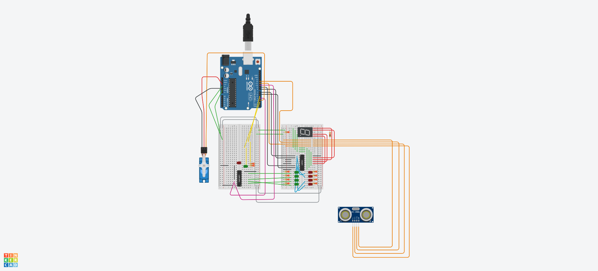

## Descrição do Projeto

### Imagem do projeto




### Links
TinkerCAD https://www.tinkercad.com/things/5qRTcGTGrnI-projeto-sistemas-digitais

YouTube

## Código do Arduino

```c
#include <Servo.h>

#define echo 12
#define trig 11

#define ledVerde 2
#define ledVermelho 5

#define contador 4
#define reset 10

Servo servo;

float ultrassonico() {
  digitalWrite(trig, HIGH);
  delayMicroseconds(10);
  digitalWrite(trig, LOW);

  float sinal = pulseIn(echo, HIGH);
  float tempo = sinal / 58.0; 
  return tempo;
}

void acao() {
  digitalWrite(ledVermelho, LOW);
  digitalWrite(ledVerde, HIGH);
  servo.write(90);

  for (int i = 0; i < 3; i++) {
    delay(500);
    digitalWrite(contador, HIGH);
    delay(500);
    digitalWrite(contador, LOW);
  }

  servo.write(3);
  digitalWrite(ledVermelho, HIGH);
  digitalWrite(ledVerde, LOW);

  digitalWrite(reset, HIGH);
  digitalWrite(reset, LOW);
}

void setup() {
  DDRD |= (1 << DDD6) | (1 << DDD7);
  DDRB |= (1 << DDB0) | (1 << DDB1);

  PORTD &= ~((1 << PORTD6) | (1 << PORTD7));
  PORTB &= ~((1 << PORTB0) | (1 << PORTB1));

  pinMode(trig, OUTPUT);
  pinMode(echo, INPUT);
  digitalWrite(trig, LOW);

  pinMode(ledVermelho, OUTPUT);
  pinMode(ledVerde, OUTPUT);
  digitalWrite(ledVermelho, HIGH);

  pinMode(contador, OUTPUT);
  pinMode(reset, OUTPUT);

  servo.attach(3);
  servo.write(3);

  Serial.begin(9600);
}

void loop() {
  float dist = ultrassonico();
  Serial.println(dist);

  static int i = 0;

  if (dist <= 5) {
  i++;

  if (i <= 9) {
    switch (i) {
      case 1:
        PORTD &= ~(1 << PORTD7);
        PORTB &= ~((1 << PORTB0) | (1 << PORTB1));
        PORTD |= (1 << PORTD6);
        acao();
        break;

      case 2:
        PORTD &= ~(1 << PORTD6);
        PORTB &= ~((1 << PORTB0) | (1 << PORTB1));
        PORTD |= (1 << PORTD7);
        acao();
        break;

      case 3:
        PORTB &= ~((1 << PORTB0) | (1 << PORTB1));
        PORTD |= (1 << PORTD6);
        PORTD |= (1 << PORTD7);
        acao();
        break;
      case 4:
        PORTD &= ~((1 << PORTD6) | (1 << PORTD7));
        PORTB &= ~(1 << PORTB1);
        PORTB |= (1 << PORTB0);
        acao();
        break;
        
      case 5:
        PORTD &= ~(1 << PORTD7);
        PORTB &= ~(1 << PORTB1);
        PORTB |= (1 << PORTB0);
        PORTD |= (1 << PORTD6);
        acao();
        break;

      case 6:
        PORTD &= ~(1 << PORTD6);
        PORTB &= ~(1 << PORTB1);
        PORTB |= (1 << PORTB0);
        PORTD |= (1 << PORTD7);
        acao();
        break;

      case 7:
        PORTB &= ~(1 << PORTB1);
        PORTB |= (1 << PORTB0);
        PORTD |= (1 << PORTD7);
        PORTD |= (1 << PORTD6);
        acao();
        break;
  
      case 8:
        PORTD &= ~((1 << PORTD6) | (1 << PORTD7));
        PORTB &= ~(1 << PORTB0);
        PORTB |= (1 << PORTB1);
        acao();
        break;

      case 9:
        PORTD &= ~(1 << PORTD7);
        PORTB &= ~(1 << PORTB0);
        PORTB |= (1 << PORTB1);
        PORTD |= (1 << PORTD6);
        acao();
        break;
      } 
    }
    else {
       digitalWrite(ledVermelho, LOW);
       digitalWrite(ledVerde, HIGH);
       servo.write(90);

       PORTD &= ~((1 << PORTD6) | (1 << PORTD7));
       PORTB &= ~((1 << PORTB0) | (1 << PORTB1));

       for (int i = 0; i <= 3; i++) {
       delay(250);
       digitalWrite(contador, HIGH);
       delay(250);
       digitalWrite(contador, LOW);
     }

       PORTD |= (1 << PORTD6) | (1 << PORTD7);
       PORTB |= (1 << PORTB0) | (1 << PORTB1);

       delay(500);
       digitalWrite(ledVermelho, HIGH);
       digitalWrite(ledVerde, LOW);
       servo.write(3);
       PORTD &= ~((1 << PORTD6) | (1 << PORTD7));
       PORTB &= ~((1 << PORTB0) | (1 << PORTB1));

       delay(500);
       PORTD |= (1 << PORTD6) | (1 << PORTD7);
       PORTB |= (1 << PORTB0) | (1 << PORTB1);

       delay(500);
       i=1;
       PORTD &= ~(1 << PORTD7);
       PORTB &= ~((1 << PORTB0) | (1 << PORTB1));
       PORTD |= ~(1 << PORTD6);
    }
  }
}
```
