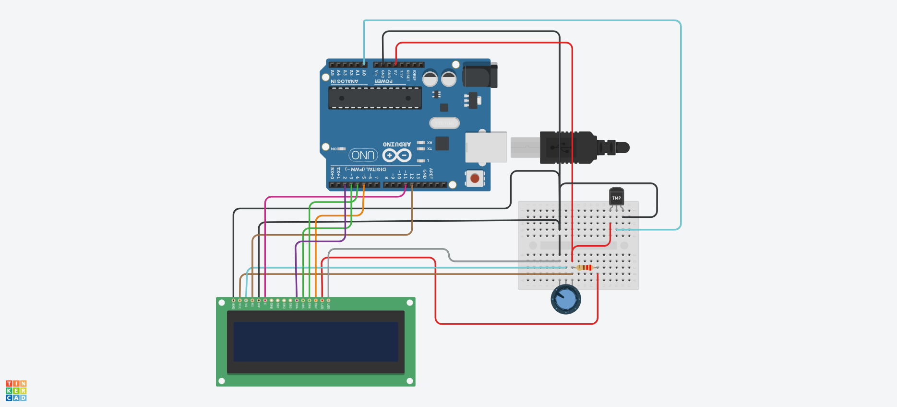

## Descrição do Projeto

### Imagem do projeto




### Links
TinkerCAD https://www.tinkercad.com/things/aoQAA7DKwC7/editel?sharecode=F6PGMv3piJodrsA1x9NOaIvHbqG-qAxTmT4-Iw01IDA

YouTube

## Código do Arduino

```c
#include <LiquidCrystal.h>

// Inicializar a biblioteca com os números dos pinos digitais
LiquidCrystal lcd(12, 11, 2, 3, 4, 5);

// Variáveis para leitura e interpretação das leituras do TMP36
const int TEMP=0;
int val = 0;
float celsius=0.0;

void setup()
{
    // Configurar o número de colunas e linhas do LCD:
    lcd.begin(16, 2);

    // Texto a ser mostrado no LCD (texto fixo, primeira linha):
    lcd.print("Temp. °C");
}

void loop()
{
    // Posicionar o cursor na coluna 0 e linha 1 (segunda linha):
    lcd.setCursor(0, 1);

    // Ler o valor enviado pelo sensor
    val = analogRead(TEMP);

    // Calcular e ajustar a temperatura em graus Celsius
    celsius = map(((val - 20) * 3.04), 0, 1023, -40, 125); 

    // Imprimir no LCD a temperatura
    lcd.print(celsius);
}

```
