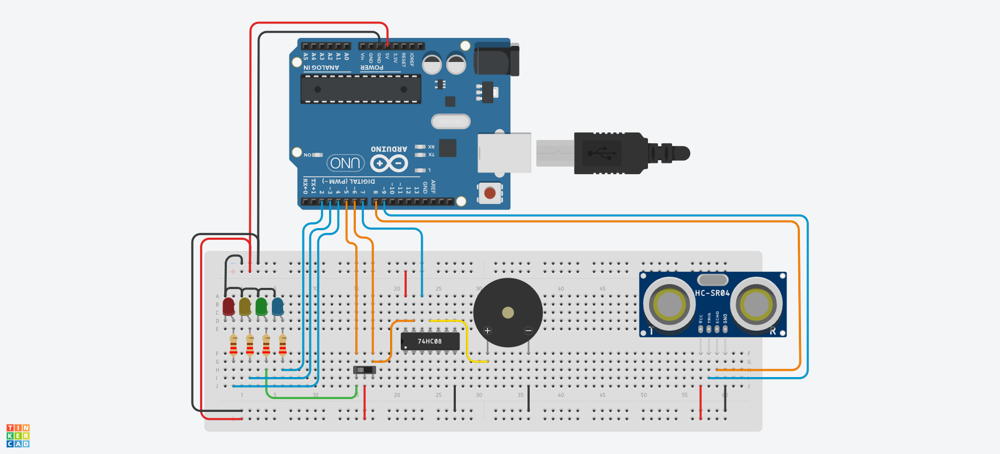

## Descrição do Projeto
Este projeto tem como objetivo desenvolver um sistema de alarme utilizando um Arduino
Uno R3, um sensor ultrassônico SR04 para detecção de movimento, um circuito lógico
baseado no CI 7408 (portas AND) e uma sirene de 12V como alerta sonoro. Além disso,
LEDs de diferentes cores indicarão o estado do sistema, que pode ser ativado ou
desativado por um interruptor de alavanca.

### Imagem do projeto




### Links
TinkerCAD https://www.tinkercad.com/things/e4KJ1JO6qBt-smooth-blad-vihelmo/editel?returnTo=https%3A%2F%2Fwww.tinkercad.com%2Fdashboard&sharecode=DrWibqjph0yM1GNqyMRS9zkhlEYBifziXit1O2ooP3g

YouTube https://youtu.be/ZxtQE8TBQN8

## Código do Arduino

```c
const int desativadoPin = 5;
const int ativadoPin = 6;
const int sirenePin = 7;
const int echoPin = 8;
const int triggerPin = 9;
const int ledAmarelo = 3;
const int ledVermelho = 4;
const int ledAzul = 2;

long duracao;
int distancia;
bool alarmado = false;
bool disparado = false;

void setup(){
  pinMode(desativadoPin, INPUT);
  pinMode(ativadoPin, INPUT);
  pinMode(sirenePin, OUTPUT);
  pinMode(echoPin, INPUT);
  pinMode(triggerPin, OUTPUT);
  pinMode(ledAmarelo, OUTPUT);
  pinMode(ledVermelho, OUTPUT);
  pinMode(ledAzul, OUTPUT);
  
  Serial.begin(9600);
}

void loop(){
  
  //DESARMADO, apenas o led verde fica aceso a fim de indicar que o sistema está desativado
  
  if(digitalRead(desativadoPin) == HIGH){  
    digitalWrite(ledAzul, LOW);
    digitalWrite(ledAmarelo, LOW);
    digitalWrite(ledVermelho, LOW);    
    digitalWrite(sirenePin, LOW);
    alarmado = false;
    disparado = false;
  }
  
  /*Caso contrário, ALARMADO, o sistema monitora a distância e caso haja interrompimento do sinal antes do esperado,
  ele irá disparar a sirene intermitente e o led amarelo contínuo*/
  
  else if(digitalRead(ativadoPin) == HIGH){
    digitalWrite(ledAzul, LOW);
    alarmado = true;
    digitalWrite(ledVermelho, millis()%1000 < 500 ? HIGH : LOW);    
    
    //Monitoramento da distância por meio do sensor
    
    digitalWrite(triggerPin, LOW);
    delayMicroseconds(2);
    digitalWrite(triggerPin, HIGH);
    delayMicroseconds(10);
    digitalWrite(triggerPin, LOW);
    
    /*Calcula a distância através da velocidade do som e do 
    tempo de pulso do echo*/
    
    duracao = pulseIn(echoPin, HIGH);
    distancia = duracao * 0.034 / 2;
    
    Serial.print("Distancia: ");
    Serial.println(distancia);
    
    //Caso a distancia seja maior que 0 e menor que 0.6m, o alarme é disparado

    if (distancia <= 60 && distancia > 0){
      disparado = true;
    }
    
    //O led amarelo é ativado para indicar que houve disparo

    if (disparado){
      digitalWrite(ledVermelho, LOW);
      digitalWrite(ledAmarelo, HIGH);
      digitalWrite(sirenePin, millis() %1000 < 500 ? HIGH : LOW);
    }
  }
 
  //FALHA NO PROGRAMA, FALTA DE ALIMENTAÇÃO, ETC
          
  else{
    digitalWrite(ledAzul, HIGH);
  }
              
  delay(100);
}
```
