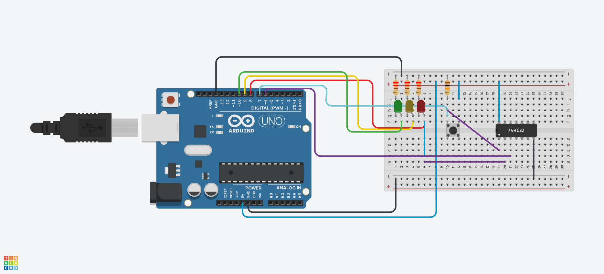

## Descrição do Projeto
O projeto se refere a um semáforo com LEDs verde, amarelo e vermelho com
um botão para acionamento de pedestre para aumentar o tempo do semáforo
vermelho. Este botão tem seu estado alterado por uma lógica OR. Foram utilizados,
portanto, os LEDs citados para representar o semáforo; um LED azul para
representar o acionamento do botão e o próprio botão. O desenvolvimento do
projeto se deu com o uso de uma placa de Arduino e uma protoboard.
### Imagem do projeto




### Links
TinkerCAD https://www.tinkercad.com/things/0bAw5THBLfq-projeto-final-sistemas-digitais/editel?sharecode=lXNXb1lPUAXh5YZBOSucny4OZI8Cs3O_Qe_lcNzEGMI

YouTube

## Código do Arduino

```c
const int botao = 7;         // Botão de pedestre
const int portaOR_saida = 6; // Saída da porta OR (pino 3 do 74HC32)
const int ledVermelho = 8;
const int ledAmarelo = 9;
const int ledVerde = 10;

bool portaORAtivada = false;  // Variável para controlar o estado da porta OR

void setup() {
  Serial.begin(9600);  // Inicializa a comunicação serial

  pinMode(botao, INPUT); // Ativa resistor pull-down interno
  pinMode(portaOR_saida, INPUT);  // Leitura da saída da porta OR
  pinMode(ledVermelho, OUTPUT);
  pinMode(ledAmarelo, OUTPUT);
  pinMode(ledVerde, OUTPUT);
  
  digitalWrite(ledVermelho, LOW);
  digitalWrite(ledVerde, LOW);
  digitalWrite(ledAmarelo, LOW);
}

void loop() {
  
  // Estado Verde
  digitalWrite(ledVermelho, LOW);
  digitalWrite(ledVerde, HIGH);
  Serial.println("LED Verde ACESO");
  delay(500);
  
  // Lendo o estado do botão
  bool botaoPressionado = debounceBotao(); 
  Serial.print("Botão pressionado: ");
  Serial.println(botaoPressionado ? "SIM" : "NÃO");  // Print do estado do botão

  // Lendo a saída da porta OR (verifica se o botão ou o LED vermelho estão ativados)
  bool tempoExtraNoVermelho = digitalRead(portaOR_saida);
  Serial.print("Estado da porta OR (extra no vermelho): ");
  Serial.println(tempoExtraNoVermelho ? "SIM" : "NÃO");  // Print do estado da porta OR

  // Se o botão foi pressionado e a porta OR não foi ativada, ativa a porta OR
  if (botaoPressionado && !portaORAtivada) {
    portaORAtivada = true;
    Serial.println("Porta OR ATIVADA");
  }

  // Estado Amarelo
  digitalWrite(ledVerde, LOW);
  digitalWrite(ledAmarelo, HIGH);
  Serial.println("LED Amarelo ACESO");
  delay(500);

  // Estado Vermelho
  digitalWrite(ledAmarelo, LOW);
  digitalWrite(ledVermelho, HIGH);
  Serial.println("LED Vermelho ACESO");

  // Se a porta OR ou o botão estiverem ativados, fica 3000ms no vermelho
  if (tempoExtraNoVermelho || portaORAtivada) {
    delay(3000);  // Aguarda 3000ms
    portaORAtivada = false;  // Reseta a porta OR após o tempo
    Serial.println("Porta OR DESATIVADA");
  } else {
    delay(500);  // Fica apenas 500ms no vermelho
  }

  // Após o LED vermelho apagar, o estado da porta OR deve ser verificado novamente
}

bool debounceBotao() {
  bool estadoAtual = digitalRead(botao);
  delay(50);  // Tempo para estabilizar a leitura
  return digitalRead(botao) == estadoAtual ? estadoAtual : LOW;
}
```


