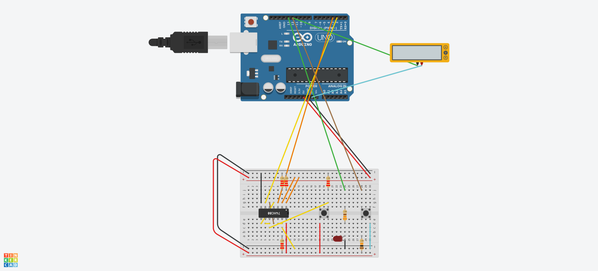

## Descrição do Projeto

### Imagem do projeto




### Links
TinkerCAD

YouTube

## Código do Arduino

```c
// Alarm status variable
volatile int alarmState = 0;
 
// Reset button state variable
int buttonState = 0;
 
// Alarm loop pin values
int openLoopVal;
int closedLoopVal;
 
// LED Alarm Indicator
int alarmLED = 13;
 
// Alarm Reset Switch
int alarmReset = 12;
 
// Alarm Interrupt inputs
int openLoop = 2;
int closedLoop = 3;
 
void setup() {
  // Initialize serial port at 9600 bps:
  Serial.begin(9600);
 
  // Define inputs and outputs
  pinMode(alarmLED, OUTPUT);
  pinMode(alarmReset, INPUT);
 
  // Attach alarm interrupt handlers
  attachInterrupt(0, ol_ISR, CHANGE);
  attachInterrupt(1, cl_ISR, CHANGE);
 
}
 
void ol_ISR() {
  // Open Loop intrusion detected
 
  // Change alarm state
  alarmState = 1;
 
  // Activate alarm LED
  digitalWrite(alarmLED, HIGH);
 
}
 
void cl_ISR() {
  // Closed Loop intrusion detected
 
  // Change alarm state
  alarmState = 2;
 
  // Activate alarm LED
  digitalWrite(alarmLED, HIGH);
 
}
 
void clearAlarm() {
  // Clear alarm LED
  digitalWrite(alarmLED, LOW);
 
  // Reset the alarm state variable
  alarmState = 0;
 
  // Print to Serial Monitor
  Serial.println("Alarm Reset");
}
 
void loop() {
 
  // Print alarm status to serial monitor
  if (alarmState == 0) {
    Serial.println("OK");
  }
  else if (alarmState == 1) {
    Serial.println("Open Loop Alarm");
  } else if (alarmState == 2) {
    Serial.println("Closed Loop Alarm");
  }
 
  // Check for reset pushbutton
  buttonState = digitalRead(alarmReset);
 
  if (buttonState == LOW) {
    // Reset has been pressed
    // Read current loop status values
    openLoopVal = digitalRead(openLoop);
    closedLoopVal = digitalRead(closedLoop);
 
    if (openLoopVal == HIGH) {
      // Open Loop condition still exists
      Serial.println("Cannot reset - Open Loop Alarm still exists");
    } else if (closedLoopVal == HIGH) {
      // Closed Loop condition still exists
      Serial.println("Cannot reset - Closed Loop Alarm still exists");
    } else {
      // Clear the alarm
      clearAlarm();
    }
 
  }
 
  // Slight delay to end loop
  delay(100);
}
```
