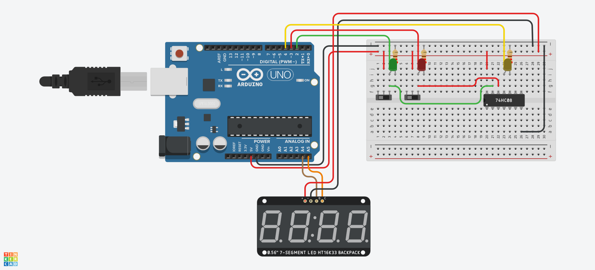

## Descrição do Projeto

### Imagem do projeto




### Links
TinkerCAD

YouTube
https://drive.google.com/file/d/124SJhxuyEpgchZG35F_C_ssa-mfj4S8F/view

## Código do Arduino

```c
#include "TM1637.h"
//biblioteca que controla o TM1637


const int CLK = 6;
const int DIO = 7;
TM1637 tm1637(CLK, DIO);
// setup do display

float seconds = 0.0;  //valor mostrado no display 
int buttonplus=0;     //estado da entrada 2 (botão verde)
int buttonminus=0;    //estado da entrada 3 (botão vermelho)
int pressedplus=0;    
int pressedminus=0;   
int reset=0;          //estado da entrada 4 (saída AND)

void setup() {
  tm1637.init();
  tm1637.set(BRIGHT_TYPICAL);
  //setup do display
  
  pinMode(2, INPUT);
  pinMode(3, INPUT);
  pinMode(4, INPUT);
  //setup das entradas
}

void loop() {
  buttonplus = digitalRead(2);
  buttonminus = digitalRead(3);
  reset = digitalRead(4);
  //lendo entradas
  
  if(buttonplus==LOW) pressedplus=0;
  else if(buttonplus==HIGH&&pressedplus==0){
    pressedplus =1;
    seconds+=1;
  }
  //lógica que faz o botão verde só incrementar seconds em +1 
  //independente de quanto tempo o botão seja segurado

  if(buttonminus==LOW) pressedminus=0;
  else if(buttonminus==HIGH&&pressedminus==0){
    pressedminus =1;
    seconds-=1;
  }
  //mesma coisa, para o botão vermelho

  if(reset==HIGH) {
    seconds=0.0;
    tm1637.displayStr((char *)" RST");  //caso esteja em reset, mostra reset na tela
  }
  else if(seconds==0) tm1637.displayStr((char *)"   0");  
  //normalmente, esta biblioteca deixa o display escuro ao mostrar um valor igual a 0. Logo, é necessário imprimir ele como string.
  else tm1637.displayNum(seconds);  //se não, mostra o valor armazenado.
  delay(1);
}

```

```c
#include "Adafruit_LEDBackpack.h" 
//biblioteca que controla o HT16K33

int seconds = 0;	//valor mostrado no display 
int buttonplus=0;	//estado da entrada 2 (botão verde)
int buttonminus=0;	//estado da entrada 3 (botão vermelho)
int pressedplus=0;	
int pressedminus=0;	
int reset=0;		//estado da entrada 4 (saída AND)

Adafruit_7segment led_display1 = Adafruit_7segment();
//setup do display

void setup()
{
  led_display1.begin(112);	
  //setup do display
  
  pinMode(2, INPUT);
  pinMode(3, INPUT);
  pinMode(4, INPUT);
  //setup das entradas
}

void loop()
{
  buttonplus = digitalRead(2);
  buttonminus = digitalRead(3);
  reset = digitalRead(4);
  //lendo entradas
  
  if(buttonplus==LOW) pressedplus=0;
  else if(buttonplus==HIGH&&pressedplus==0){
    pressedplus =1;
    seconds+=1;
  }
  //lógica que faz o botão verde só incrementar seconds em +1 
  //independente de quanto tempo o botão seja segurado
  
  if(buttonminus==LOW) pressedminus=0;
  else if(buttonminus==HIGH&&pressedminus==0){
    pressedminus =1;
    seconds-=1;
  }
  //mesma coisa, para o botão vermelho
  
  if(reset==HIGH) {
    seconds=0;
    led_display1.print(" RST");	//caso esteja em reset, imprime reset
  }
  else led_display1.println(seconds);
  //se não, imprime o valor armazenado
  led_display1.writeDisplay(); //display do valor impresso
  delay(1);
  }
  ```