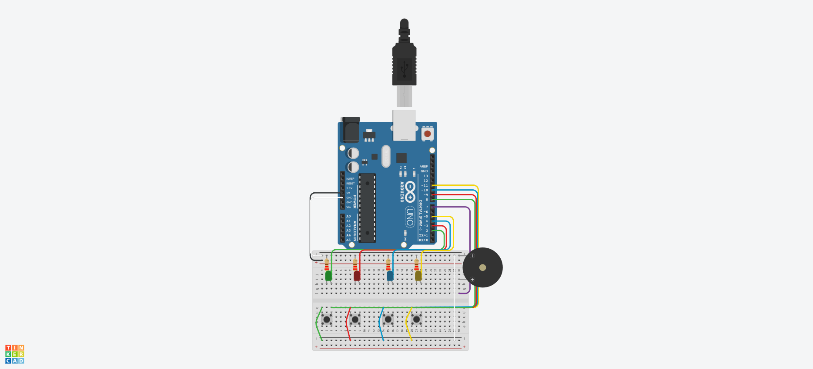

Yuri Ramos Borges 

Este projeto implementa o jogo Genius usando um Arduino, desafiando o jogador a repetir sequências de luzes e sons. O Arduino gera e exibe uma sequência de luzes, que o jogador deve repetir. Acertando, a sequência aumenta. Errando, os LEDs piscam, um som de erro é tocado, e o jogo reinicia após alguns segundos e um toque no botão.

Componentes)
- 1x Arduino UNO:  O cérebro que comanda o jogo, gera sequências e lê as ações do jogador.
-4x LEDs: Luzes coloridas que mostram a sequência e indicam acertos/erros.
-4x Resistores (220 ohms): Protegem os LEDs, limitando a corrente elétrica.
- 4x Botões: As entradas do jogador, usadas para repetir a sequência de luzes e sons.
- 1x Buzzer Ativo: Emite os sons do jogo, com notas para cada cor e um som de erro.
- Protoboard: Placa para montar e conectar os componentes sem solda.
- Fios Jumper: Conectam os componentes entre si e ao Arduino.

Link TinkerCAD (Projeto Genius): 
https://www.tinkercad.com/things/708XIMkEXxG-projeto-genius/editel?returnTo=%2Fthings%2F708XIMkEXxG-projeto-genius&sharecode=5R3C7vwXJ_rLsiBDDnBNABrJ7Kx5_eVhcdozX_zjNKw

Link Vídeo de Teste: 
https://youtube.com/shorts/f1R4iqAajYU?si=yrzc6AZ9ckMW_j0d





## Código do Arduino

```c
const int LEDs[] = {2, 3, 4, 5};
const int BOTOES[] = {8, 9, 10, 11};
const int BUZZER = 7;

const int NOTAS[] = {349, 330, 294, 262};
const int NOTA_ERRO = 100;

int sequencia[100];
int rodadaAtual = 0;
int entradaUsuario = 0;

enum EstadoJogo {
  INICIO,
  MOSTRANDO_SEQUENCIA,
  ESPERANDO_ENTRADA,
  ERRO
};
EstadoJogo estadoAtual = INICIO;

void setup() {
  for (int i = 0; i < 4; i++) {
    pinMode(LEDs[i], OUTPUT);
    pinMode(BOTOES[i], INPUT_PULLUP);
  }
  pinMode(BUZZER, OUTPUT);
  randomSeed(analogRead(A0));
}

void loop() {
  switch (estadoAtual) {
    case INICIO:
      iniciarJogo();
      break;
    case MOSTRANDO_SEQUENCIA:
      mostrarSequencia();
      break;
    case ESPERANDO_ENTRADA:
      coletarEntradaUsuario();
      break;
    case ERRO:
      piscarErro();
      break;
  }
}

void iniciarJogo() {
  rodadaAtual = 0;
  entradaUsuario = 0;
  for (int i = 0; i < 100; i++) {
    sequencia[i] = 0;
  }
  piscarTodos(100, 2);
  delay(500);
  proximaRodada();
}

void proximaRodada() {
  rodadaAtual++;
  entradaUsuario = 0;
  sequencia[rodadaAtual - 1] = random(0, 4);
  estadoAtual = MOSTRANDO_SEQUENCIA;
}

void mostrarSequencia() {
  delay(1000);
  for (int i = 0; i < rodadaAtual; i++) {
    acionarCor(sequencia[i], 400);
    delay(200);
  }
  estadoAtual = ESPERANDO_ENTRADA;
}

void coletarEntradaUsuario() {
  int botaoPressionado = lerBotoes();
  if (botaoPressionado != -1) {
    acionarCor(botaoPressionado, 200);
    if (botaoPressionado == sequencia[entradaUsuario]) {
      entradaUsuario++;
      if (entradaUsuario == rodadaAtual) {
        delay(500);
        proximaRodada();
      }
    } else {
      estadoAtual = ERRO;
    }
  }
}

void piscarErro() {
  tone(BUZZER, NOTA_ERRO, 500);
  delay(500);
  noTone(BUZZER);

  for (int i = 0; i < 3; i++) {
    piscarTodos(300, 1);
  }

  delay(5000);

  while (lerBotoes() == -1) {
  }
  estadoAtual = INICIO;
}

void acionarCor(int corIndex, int duracao) {
  digitalWrite(LEDs[corIndex], HIGH);
  tone(BUZZER, NOTAS[corIndex], duracao);
  delay(duracao);
  digitalWrite(LEDs[corIndex], LOW);
  noTone(BUZZER);
}

int lerBotoes() {
  for (int i = 0; i < 4; i++) {
    if (digitalRead(BOTOES[i]) == LOW) {
      delay(50);
      while (digitalRead(BOTOES[i]) == LOW);
      return i;
    }
  }
  return -1;
}

void piscarTodos(int duracao, int vezes) {
  for (int j = 0; j < vezes; j++) {
    for (int i = 0; i < 4; i++) {
      digitalWrite(LEDs[i], HIGH);
    }
    delay(duracao);
    for (int i = 0; i < 4; i++) {
      digitalWrite(LEDs[i], LOW);
    }
    delay(duracao);
  }
}
```

Nome,Quantidade,Componente
"U1",1," Arduino Uno R3"
"PIEZO1",1," Piezo"
"RR_Azul, RR_Vermelho, RR_Amarelo, RR_Verde",4,"220 Ω Resistor"
"D1",1,"Vermelho LED"
"D2",1,"Azul LED"
"D3",1,"Amarelo LED"
"D4",1,"Verde LED"
"SB_Azul, SB_Vermelho, SB_Verde, SB_Amarelo",4," Botão"