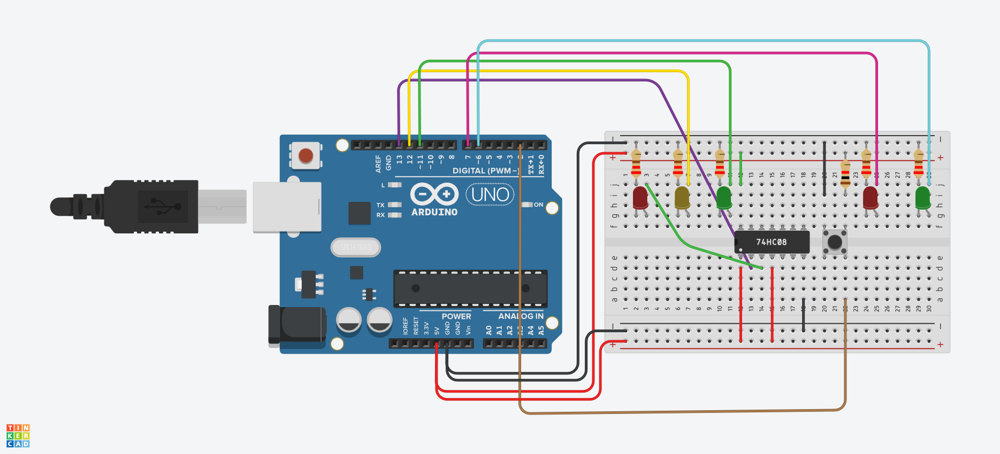

## Descrição do Projeto

### Imagem do projeto




### Links
TinkerCAD
https://www.tinkercad.com/things/1PyKWJpS5tw/editel?sharecode=NOI8mlW0Vtc4UgdFi8wUsgWJ5FGRibKn0wvT2ZpgmZ8

YouTube
https://www.youtube.com/watch?v=vrCpsXgOvYw

## Código do Arduino

```c
// Pinos
const int vermelhoCarro = 13;
const int amareloCarro = 12;
const int verdeCarro = 11;
const int vermelhoPed = 7;
const int verdePed = 6;
const int botaoPed = 2;

bool pedestreSolicitou = false;

void setup() {
  pinMode(vermelhoCarro, OUTPUT);
  pinMode(amareloCarro, OUTPUT);
  pinMode(verdeCarro, OUTPUT);
  pinMode(vermelhoPed, OUTPUT);
  pinMode(verdePed, OUTPUT);
  pinMode(botaoPed, INPUT); // Assumindo botão ligado ao GND com pull-up externo

  // Estado inicial
  digitalWrite(vermelhoCarro, LOW);
  digitalWrite(amareloCarro, LOW);
  digitalWrite(verdeCarro, HIGH);

  digitalWrite(vermelhoPed, HIGH);
  digitalWrite(verdePed, LOW);
}

// Função de delay com verificação de botão
void delayComVerificacao(int tempoTotal) {
  for (int i = 0; i < tempoTotal; i += 100) {
    if (digitalRead(botaoPed) == LOW) {
      pedestreSolicitou = true;
    }
    delay(100);
  }
}

void loop() {
  // Fase verde do carro
  digitalWrite(verdeCarro, HIGH);
  digitalWrite(amareloCarro, LOW);
  digitalWrite(vermelhoCarro, LOW);
  delayComVerificacao(3000);

  // Se o botão foi pressionado, interrompe e inicia travessia
  if (pedestreSolicitou) {
    digitalWrite(verdeCarro, LOW);
    digitalWrite(amareloCarro, HIGH);
    delay(2000);

    digitalWrite(amareloCarro, LOW);
    digitalWrite(vermelhoCarro, HIGH);

    digitalWrite(vermelhoPed, LOW);
    digitalWrite(verdePed, HIGH);
    delay(5000);

    digitalWrite(verdePed, LOW);
    digitalWrite(vermelhoPed, HIGH);
    delay(1000);

    digitalWrite(vermelhoCarro, LOW);
    digitalWrite(verdeCarro, HIGH);

    pedestreSolicitou = false;
    return; // Volta ao começo do loop
  }

  // Continua o ciclo normal
  digitalWrite(verdeCarro, LOW);
  digitalWrite(amareloCarro, HIGH);
  delayComVerificacao(2000);

  digitalWrite(amareloCarro, LOW);
  digitalWrite(vermelhoCarro,HIGH);
  delayComVerificacao(2000);

  digitalWrite(vermelhoCarro,LOW);
}
    

```


