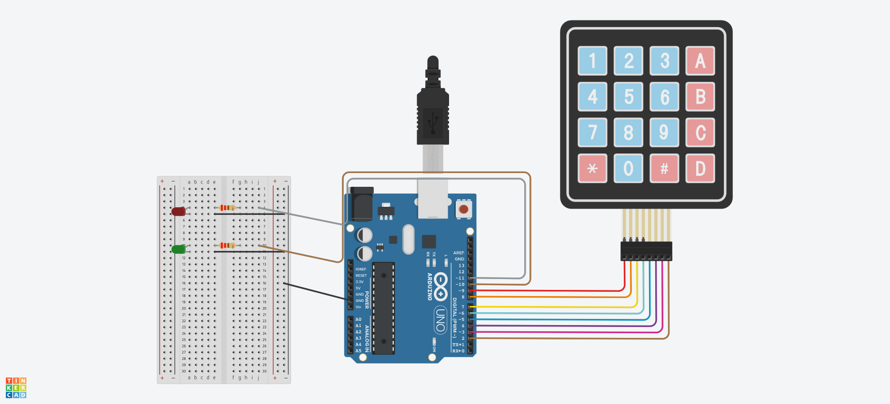

## Descrição do Projeto

### Imagem do projeto




### Links
TinkerCAD

YouTube

https://youtube.com/shorts/yfTpbzae8bY?feature=share -  video de explicação. 

https://www.tinkercad.com/things/8Knye0o7zFf/editel?returnTo=/dashboard/designs/circuits&sharecode=bkw9bP5CmTsnd3IuuAnAZBnyZ3l2M70h_mYhSJZWgik - Tinkercad 

https://docs.google.com/document/d/1bPZ2heu1X5d5iTuJQ17Lxfc5fPq6lZBA/edit?usp=sharing&ouid=116166013505917046745&rtpof=true&sd=true - documento


## Código do Arduino

```c
#include <Keypad.h>

const byte LINHAS = 4;
const byte COLUNAS = 4;

char TECLAS_MATRIZ[LINHAS][COLUNAS] = {
  {'1','2','3','A'},
  {'4','5','6','B'},
  {'7','8','9','C'},
  {'*','0','#','D'}
};

byte PINOS_LINHAS[LINHAS] = {9, 8, 7, 6};
byte PINOS_COLUNAS[COLUNAS] = {5, 4, 3, 2};

Keypad teclado = Keypad(makeKeymap(TECLAS_MATRIZ), PINOS_LINHAS, PINOS_COLUNAS, LINHAS, COLUNAS);

String senhaCorreta = "8765";
String senhaDigitada = "";

const int LED_VERDE = 10;
const int LED_VERMELHO = 11;

void setup() {
  Serial.begin(9600);
  pinMode(LED_VERDE, OUTPUT);
  pinMode(LED_VERMELHO, OUTPUT);
  digitalWrite(LED_VERDE, LOW);
  digitalWrite(LED_VERMELHO, LOW);
}

void loop() {
  char tecla = teclado.getKey();

  if (tecla) {
    Serial.println(tecla);

    if (tecla == 'C') {
      if (senhaDigitada == senhaCorreta) {
        Serial.println("Senha correta!");
        for (int i = 0; i < 5; i++) {
          digitalWrite(LED_VERDE, HIGH);
          delay(100);
          digitalWrite(LED_VERDE, LOW);
          delay(100);
        }
      } else {
        Serial.println("Senha incorreta!");
        for (int i = 0; i < 5; i++) {
          digitalWrite(LED_VERMELHO, HIGH);
          delay(100);
          digitalWrite(LED_VERMELHO, LOW);
          delay(100);
        }
      }
      senhaDigitada = "";
    } else if (tecla == '*') {
      senhaDigitada = "";
      Serial.println("Senha apagada.");
    } else {
      senhaDigitada += tecla;
    }
  }
}


```
