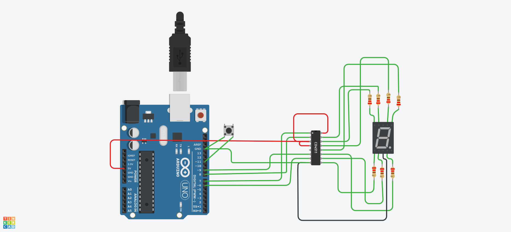

## Descrição do Projeto

### Imagem do projeto




### Links
https://www.tinkercad.com/things/3Cl0ku7iMkw-projeto-final-arduino-7-segmentos?sharecode=11-WU88_LCd7W2FFd6Tnxsq-VMBgI5QtsutB7PzPTZI

https://youtu.be/NPRgP9nv82Q?feature=shared

## Código do Arduino

```c
// Definição dos pinos de saída BCD
const int pinoA = 6;
const int pinoB = 7;
const int pinoC = 8;
const int pinoD = 9;

// Pino do botão
const int botao = 11;

// Variáveis para controle de botão
bool estadoBotaoAnterior = HIGH;  // Começa em HIGH por causa do pull-up
int numeroAtual = 0;

void setup() {
  pinMode(pinoA, OUTPUT);
  pinMode(pinoB, OUTPUT);
  pinMode(pinoC, OUTPUT);
  pinMode(pinoD, OUTPUT);

  pinMode(botao, INPUT_PULLUP);  // Ativa resistor pull-up interno

  Serial.begin(9600);
  Serial.println("Iniciando contagem controlada por botão...");
  exibirNumero(numeroAtual); // Começa exibindo 0
}

void loop() {
  bool estadoBotao = digitalRead(botao);

  // Detecta transição HIGH -> LOW (borda de descida)
  if (estadoBotao == LOW && estadoBotaoAnterior == HIGH) {
    numeroAtual++;
    if (numeroAtual > 9) numeroAtual = 0;

    exibirNumero(numeroAtual);

    Serial.print("Número exibido no display: ");
    Serial.println(numeroAtual);

    delay(200); // Debounce simples
  }

  estadoBotaoAnterior = estadoBotao;
}

void exibirNumero(int numero) {
  int bitD = (numero & B1000) ? HIGH : LOW;
  int bitC = (numero & B0100) ? HIGH : LOW;
  int bitB = (numero & B0010) ? HIGH : LOW;
  int bitA = (numero & B0001) ? HIGH : LOW;

  digitalWrite(pinoD, bitD);
  digitalWrite(pinoC, bitC);
  digitalWrite(pinoB, bitB);
  digitalWrite(pinoA, bitA);
}

```


