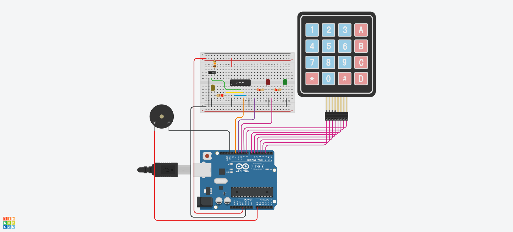

## Descrição do Projeto

### Imagem do projeto




### Links
TinkerCAD

YouTube
https://drive.google.com/file/d/1N2P3PMl2uW_fFZObQfq5Q44-6Sbxekb9/view?usp=sharing

https://www.tinkercad.com/things/kcmBPyrjgZS-projeto-final-sistemas-digitais?sharecode=aTEomYRN2du77Ek8ZQOlkfJUcZjU8zdXyfTkkbGEzKI

## Código do Arduino

```c
#include <Keypad.h>

// Teclado Matricial
const byte LINHAS = 4;
const byte COLUNAS = 4;

char teclas[LINHAS][COLUNAS] = {
  {'1','2','3','A'},
  {'4','5','6','B'},
  {'7','8','9','C'},
  {'*','0','#','D'}
};

byte pinosLinhas[LINHAS] = {2, 3, 4, 5};
byte pinosColunas[COLUNAS] = {6, 7, 8, 9};

Keypad teclado = Keypad(makeKeymap(teclas), pinosLinhas, pinosColunas, LINHAS, COLUNAS);

// Saidas 
const int SISTEMA_ATIVO = 12;   // Entrada do flip-flop (Q do 7474)
const int LED_VERDE = 10;       // LED de acesso permitido
const int LED_VERMELHO = 11;    // LED de acesso negado
const int BUZZER = A0;          // Pino do buzzer

// Comparação da senha
const String senhaCorreta = "1234";
String senhaDigitada = "";

void setup() {
  pinMode(SISTEMA_ATIVO, INPUT);
  pinMode(LED_VERDE, OUTPUT);
  pinMode(LED_VERMELHO, OUTPUT);
  pinMode(BUZZER, OUTPUT);
  Serial.begin(9600);

// Leds de saida desligados ao iniciar
  digitalWrite(LED_VERDE, LOW);
  digitalWrite(LED_VERMELHO, LOW);
}

void loop() {
  bool ligado = digitalRead(SISTEMA_ATIVO) == HIGH;

  if (ligado) {
    char tecla = teclado.getKey();

    if (tecla != NO_KEY) {
      beep(50);
      Serial.print("Tecla: ");
      Serial.println(tecla);

      if (tecla == '#') {
        if (senhaDigitada.length() == 4) {
          verificarSenha();
        } else {
          Serial.println("Senha incompleta, digite 4");
        }
      } else if (tecla == '*') {
        senhaDigitada = "";
        Serial.println("Senha apagada");
      } else {
        senhaDigitada += tecla;
      }
    }
  } else {
    senhaDigitada = "";
    digitalWrite(LED_VERDE, LOW);
    digitalWrite(LED_VERMELHO, LOW);
  }

  delay(50);
}

void verificarSenha() {
  if (senhaDigitada == senhaCorreta) {
    digitalWrite(LED_VERDE, HIGH);
    digitalWrite(LED_VERMELHO, LOW);
    Serial.println("Senha correta");

    for (int i = 0; i < 3; i++) {
      beep(100);
      delay(100);
    }

  } else {
    digitalWrite(LED_VERDE, LOW);
    digitalWrite(LED_VERMELHO, HIGH);
    Serial.println("Senha incorreta");

    beep(600);
  }

  delay(2000);
  digitalWrite(LED_VERDE, LOW);
  digitalWrite(LED_VERMELHO, LOW);
  senhaDigitada = "";
}

void beep(int tempo) {
  tone(BUZZER, 800);  
  delay(tempo);
  noTone(BUZZER);
}


```


