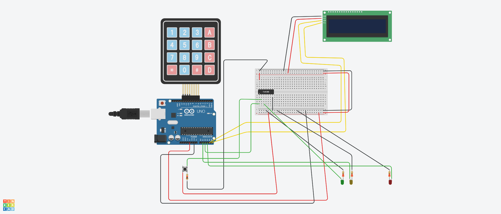

## Descrição do Projeto

Aprenda a usar um botão e acender um LED usando Arduino.



## Links
[TinkerCAD](https://www.tinkercad.com/things/3ER5cJ7FLLd-grupo-s21-a)

[YouTube](http://youtube.com/shorts/wsuzWA3krVU)

## Fluxograma em Mermaid

- https://mermaid.live/
- [State diagrams](https://mermaid.js.org/syntax/stateDiagram.html)


## Código do Arduino

```c
#include <Keypad.h>
#include <Wire.h>
#include <LiquidCrystal_I2C.h>

//LCD I2C 
LiquidCrystal_I2C lcd(0x27, 16, 2);

//TECLADO
const byte LINHAS = 4;
const byte COLUNAS = 4;

char teclas[LINHAS][COLUNAS] = {
  {'1','2','3','A'},
  {'4','5','6','B'},
  {'7','8','9','C'},
  {'*','0','#','D'}
};

byte pinosLinhas[LINHAS]  = {13, 12, 11, 10};
byte pinosColunas[COLUNAS] = {9, 8, 7, 6};

Keypad teclado = Keypad(makeKeymap(teclas),
                        pinosLinhas,
                        pinosColunas,
                        LINHAS,
                        COLUNAS);

// CONTROLE DE ACESSO USANDO LED
String senha   = "1234";
String entrada = "";

int senhaOK   = A2;   // LED VERDE ABRIR 
int ledErro   = A3;   // LED VERMELHO SENHA INCORRETA
int ledAmarelo = A1;  // LED AMARELO ACIONAR BOTÃO

//CONTROLE DE TEMPO 
unsigned long tempoInicio = 0;
const unsigned long TEMPO_LIBERADO = 3000; // 3 SEGUNDOS
bool acessoAtivo = false;

void setup() {
  pinMode(senhaOK, OUTPUT);
  pinMode(ledErro, OUTPUT);
  pinMode(ledAmarelo, OUTPUT);

  digitalWrite(senhaOK, LOW);
  digitalWrite(ledErro, LOW);
  digitalWrite(ledAmarelo, LOW);

  lcd.init();
  lcd.backlight();

  lcd.setCursor(0,0);
  lcd.print("Digite a senha");
}

void loop() {
  

//CONTROLE DO TEMPO 
  
  if (acessoAtivo) {
    if (millis() - tempoInicio >= TEMPO_LIBERADO) {
      acessoAtivo = false;

      digitalWrite(senhaOK, LOW);
      digitalWrite(ledAmarelo, LOW);

      lcd.clear();
      lcd.print("Digite a senha");
    }
  }

  // LEITURA DO TECLADO 
  char tecla = teclado.getKey();

  if (tecla && !acessoAtivo) {

    if (tecla == '#') {

      if (entrada == senha) {

        digitalWrite(senhaOK, HIGH);
        digitalWrite(ledErro, LOW);
        digitalWrite(ledAmarelo, HIGH);

        lcd.clear();
        lcd.setCursor(0,0);
        lcd.print("Acesso");
        lcd.setCursor(0,1);
        lcd.print("LIBERADO");

        tempoInicio = millis();
        acessoAtivo = true;
      }
      else {

        digitalWrite(senhaOK, LOW);
        digitalWrite(ledErro, HIGH);

        lcd.clear();
        lcd.setCursor(0,0);
        lcd.print("Senha");
        lcd.setCursor(0,1);
        lcd.print("INCORRETA");

        tempoInicio = millis();
        acessoAtivo = true;
      }

      entrada = "";
    }

    else if (tecla == '*') {
      entrada = "";
      lcd.clear();
      lcd.print("Digite a senha");
    }

    else {
      entrada += tecla;
      lcd.setCursor(0,1);
      lcd.print(entrada);
    }
  }
}
```

## Lista de componentes

| Nome | Quantidade | Componente |
|---|---|---|
| D1 | 1 | Verde LED |
| D2 | 1 | Vermelho LED |
| U1 | 1 |  Arduino Uno R3 |
| KEYPAD1 | 1 |  Teclado 4x4 |
| U3 | 1 |  Porta quad AND |
| U2 | 1 | Baseado em PCF8574, 39 (0x27) LCD 16 x 2 (I2C) |
| R1, R2, R4 | 3 | 220 Ω Resistor |
| S1 | 1 |  Botão |
| R3 | 1 | 1 kΩ Resistor |
| D3 | 1 | Amarelo LED |