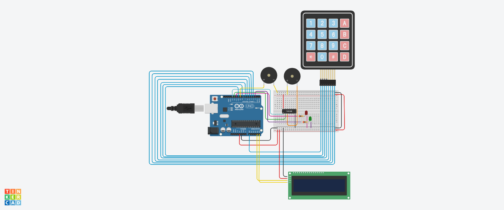
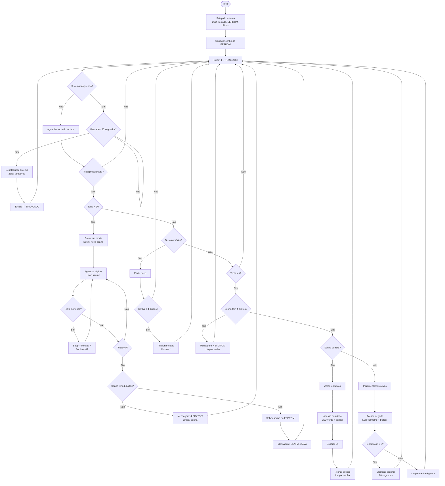

## Descrição do Projeto

Aprenda a criar um sistema de senhas com Arduino, usando teclado matricial, display LCD e controle de acesso com LEDs e buzzer. Digite a senha, com 4 dígitos, confirme no '#' e escute o barulho de confirmação. Errando a senha 3 vezes, o sistema é bloqueado por 20 segundos. Caso necessário trocar a senha, aperte 'D', digite 4 números e novamente selecione '#' para confirmá-la.



## Links
[TinkerCAD](https://www.tinkercad.com/things/a25ne7lzHhA-grupo-b?sharecode=0uKBqbSIVa-JN01VM3vUFDLR7uo5CGEqh4C6E3U0QRs)

[YouTube](https://www.youtube.com/watch?v=qnx1TBNO448)

[Mermaid](https://www.mermaidchart.com/play?utm_source=mermaid_live_editor&utm_medium=share#pako:eNqVVdtO3DAQ_ZUpqFIvoJZ7hQqVNwkQyI1NgBbDgzdxF0sbe-tkacWKD-hDv6JPfehX7I_VcbLZBELV5tGZOXPOmfF4uhSLhC7tLn0eia_xDZE5ROYVv-LPn8Peow9sb_bDsP2OX1ccvcA2n_2Ombh-Caur-9DDIc0nY0gEZCzLaUreD-SbfccwVyCi8YgkYgUsK-j77goEjIvs-or3dKqBDSIlHRIJGeU3BBJSRaoQQ4eY2PrGBkzuQgSrEPWRZyDTv36au-P7AQR92zPsADmdEkyNbE3Dki4MRuLLhCqeH-6buBDaYWS5CHqOf3pmqbJQAVgKAEKWapyDaUCyjEiSwvpbpWM44YnICqiDIsyb_RRlXHUwzzvEJs2q0rJl3SWV6iSnPCc5uyWFX4c65egpM45KrzrZo8g-bzOvKdkYDSdEJrqa6lTRw7xsmQK1dczxVDcRxpJmGROcJKS06bgF9ZdpiizDQWB2tuK46chJVWoPzKLESfOfgy2eF7bQFFKRCG2UST8zziRwcUvKCVK0nTJ-baEtmf0eslxk5VwKMQbGcyp5IdJZK8PXq9p8ks5-SRZrkc56i8IG7lE6htfgikxzeaURQz2672HzQ4G3UZWfZ9cOOZu1vOXSQWezHbC2OKxrbk1LeDUcsFkr0eS22tnb2KU8I0Oa7qpI0z60Iz98Vmpm6Xh-xwqO2_OWlRh1sR0cktFtfRt54zY6O2XIu0aV0PKOEITIOUdFxLt_GwTvzJ1979sG6hyIk5Yot6srbpOzh62U5WoGBqo1ioWnT_1p3ZSWZ34zNcAoYXEx0vWIaLfq7iq4YK7J_79pX-4U57ZATtvzcPq4wmmTbv_JSei3MsN_noNwUanfrBRVlWKhlnNOHmxFZFhh6ENg9V07shdLMWpCnOGOJXamf51jFKtVImBMZdG66i47lgm3VCZU3a_B5O6OSpVxrjMusJWNNdxWAXOhDz_iA1q8ZEA0Wpe-jx1bsWLvWYfoAfXawE_qgYslTQvqDxR80gGXcwVcPV1t-ikd3YimgkudgZDq9RwH9vdgozQVoaZpqId7Xe9B41lRiKi3kFXm18yRgZsWQMLUjKiFXWQZ86yl-z9CcXhg)

## Fluxograma em Mermaid

- Código do Fluxograma:
  ```
  graph TD
  A([Início]) --> B[Setup do sistema\nLCD, Teclado, EEPROM, Pinos]
  B --> C[Carregar senha da EEPROM]
  C --> D[Exibir: T - TRANCADO]

  D --> E{Sistema bloqueado?}

  E -- Sim --> F{Passaram 20 segundos?}
  F -- Não --> F
  F -- Sim --> G[Desbloquear sistema\nZerar tentativas]
  G --> H[Exibir: T - TRANCADO]
  H --> D

  E -- Não --> I[Aguardar tecla do teclado]
  I --> J{Tecla pressionada?}

  J -- Não --> D

  J -- Sim --> K{Tecla = D?}
  K -- Sim --> L[Entrar em modo\nDefinir nova senha]
  L --> L1[Aguardar dígitos\nLoop interno]
  L1 --> L2{Tecla numérica?}
  L2 -- Sim --> L3[Beep + Mostrar *\nSenha < 4?]
  L3 --> L1
  L2 -- Não --> L4{Tecla = #?}

  L4 -- Não --> L1
  L4 -- Sim --> L5{Senha tem 4 dígitos?}
  L5 -- Não --> L6[Mensagem: 4 DIGITOS!\nLimpar senha]
  L6 --> D
  L5 -- Sim --> L7[Salvar senha na EEPROM]
  L7 --> L8[Mensagem: SENHA SALVA]
  L8 --> D

  K -- Não --> M{Tecla numérica?}
  M -- Sim --> N[Emitir beep]
  N --> O{Senha < 4 dígitos?}
  O -- Sim --> P[Adicionar dígito\nMostrar *]
  P --> D
  O -- Não --> D

  M -- Não --> Q{Tecla = #?}
  Q -- Não --> D
  Q -- Sim --> R{Senha tem 4 dígitos?}
  R -- Não --> S[Mensagem: 4 DIGITOS!\nLimpar senha]
  S --> D
  R -- Sim --> T{Senha correta?}

  T -- Sim --> U[Zerar tentativas]
  U --> V[Acesso permitido\nLED verde + buzzer]
  V --> W[Esperar 5s]
  W --> X[Fechar acesso\nLimpar senha]
  X --> D

  T -- Não --> Y[Incrementar tentativas]
  Y --> Z[Acesso negado\nLED vermelho + buzzer]
  Z --> AA{Tentativas >= 3?}
  AA -- Sim --> AB[Bloquear sistema\n20 segundos]
  AB --> D
  AA -- Não --> AC[Limpar senha digitada]
  AC --> D
  ```

- Imagem do Fluxograma:



## Código do Arduino

```c
#include <Keypad.h>
#include <LiquidCrystal_I2C.h>
#include <EEPROM.h>

LiquidCrystal_I2C tela(0x27, 16, 2);

String senhaDigitada = "";
String senhaSalva = "";

int tentativas = 0;
bool sistemaBloqueado = false;
unsigned long momentoDesbloqueio = 0;

bool primeiraDigitacao = true;

const byte LINHAS = 4;
const byte COLUNAS = 4;

char teclas[LINHAS][COLUNAS] = {
  {'1','2','3','A'},
  {'4','5','6','B'},
  {'7','8','9','C'},
  {'*','0','#','D'}
};

byte pinosLinhas[LINHAS]  = {A0, 10, 8, 7};
byte pinosColunas[COLUNAS] = {6, 5, 4, 3};

Keypad teclado = Keypad(makeKeymap(teclas), pinosLinhas, pinosColunas, LINHAS, COLUNAS);

const int NAND_A = 13;
const int NAND_B = 12;
const int LED_VERDE = 2;
const int LED_VERMELHO = 11;
const int BUZZER_TONE = 9;

void beepCI() {
  digitalWrite(NAND_A, HIGH);
  digitalWrite(NAND_B, HIGH);
  delay(50);
  digitalWrite(NAND_A, LOW);
  digitalWrite(NAND_B, LOW);
}

void carregarSenha() {
  senhaSalva = "";
  bool vazia = true;

  for (int i = 0; i < 4; i++) {
    char c = EEPROM.read(i);
    if (c >= '0' && c <= '9') {
      senhaSalva += c;
      vazia = false;
    } else {
      senhaSalva += '0';
    }
  }

  if (vazia || senhaSalva == "0000") {
    senhaSalva = "4571";
    for (int i = 0; i < 4; i++) EEPROM.write(i, senhaSalva[i]);
  }
}

void salvarSenha(String novaSenha) {
  for (int i = 0; i < 4; i++) EEPROM.write(i, novaSenha[i]);
  senhaSalva = novaSenha;
}

void setup() {
  Serial.begin(9600);

  tela.init();
  tela.backlight();
  tela.clear();

  carregarSenha();

  pinMode(NAND_A, OUTPUT);
  pinMode(NAND_B, OUTPUT);
  pinMode(LED_VERDE, OUTPUT);
  pinMode(LED_VERMELHO, OUTPUT);
  pinMode(BUZZER_TONE, OUTPUT);

  digitalWrite(LED_VERDE, LOW);
  digitalWrite(LED_VERMELHO, HIGH);
  digitalWrite(NAND_A, LOW);
  digitalWrite(NAND_B, LOW);

  tela.setCursor(0, 0);
  tela.print("T - TRANCADO");
}

void loop() {

  if (sistemaBloqueado) {
    if (millis() - momentoDesbloqueio >= 20000) {
      sistemaBloqueado = false;
      tentativas = 0;

      tela.clear();
      tela.print("DESBLOQUEADO");
      delay(1500);

      tela.clear();
      tela.print("T - TRANCADO");
      digitalWrite(LED_VERMELHO, HIGH);
    }
    return;
  }

  char tecla = teclado.getKey();

  if (tecla != NO_KEY) {

    if (tecla == 'D') {
      definirNovaSenha();
      return;
    }

    if (tecla >= '0' && tecla <= '9') beepCI();

    if (tecla >= '0' && tecla <= '9') {

      if (senhaDigitada.length() < 4) {

        if (primeiraDigitacao) {
          tela.setCursor(0, 1);
          tela.print("                ");
          tela.setCursor(0, 1);
          primeiraDigitacao = false;
        }

        senhaDigitada += tecla;
        tela.setCursor(senhaDigitada.length() - 1, 1);
        tela.print('*');
      }
    }

    if (tecla == '#') {

      if (senhaDigitada.length() < 4) {
        tela.clear();
        tela.print("4 DIGITOS!");
        delay(1500);

        tela.clear();
        tela.print("T - TRANCADO");

        senhaDigitada = "";
        primeiraDigitacao = true;
        tela.setCursor(0,1);
        tela.print("                ");
        return;
      }
      if (senhaDigitada == senhaSalva) {
        tentativas = 0;
        acessoPermitido();
      }
      else {
        tentativas++;
        acessoNegado();

        if (tentativas >= 3) bloquearSistema();
      }

      senhaDigitada = "";
      primeiraDigitacao = true;
      tela.setCursor(0,1);
      tela.print("                ");
    }
  }
}

void bloquearSistema() {
  sistemaBloqueado = true;
  momentoDesbloqueio = millis();

  tela.clear();
  tela.print("BLOQUEADO 20s");

  digitalWrite(LED_VERMELHO, HIGH);
  tone(BUZZER_TONE, 1000);
  delay(1000);
  noTone(BUZZER_TONE);
}

void definirNovaSenha() {
  senhaDigitada = "";
  primeiraDigitacao = true;

  tela.clear();
  tela.setCursor(0, 0);
  tela.print("NOVA SENHA:");
  tela.setCursor(0, 1);

  while (true) {

    char t = teclado.getKey();

    if (t >= '0' && t <= '9') {
      beepCI();

      if (senhaDigitada.length() < 4) {

        if (primeiraDigitacao) {
          tela.setCursor(0,1);
          tela.print("                ");
          tela.setCursor(0,1);
          primeiraDigitacao = false;
        }

        senhaDigitada += t;
        tela.setCursor(senhaDigitada.length()-1,1);
        tela.print('*');
      }
    }

    if (t == '#') {

      if (senhaDigitada.length() < 4) {
        tela.clear();
        tela.print("4 DIGITOS!");
        delay(1500);

        tela.clear();
        tela.print("T - TRANCADO");
        senhaDigitada = "";
        primeiraDigitacao = true;
        return;
      }

      salvarSenha(senhaDigitada);

      tela.clear();
      tela.print("SENHA SALVA");
      delay(1500);

      tela.clear();
      tela.print("T - TRANCADO");

      senhaDigitada = "";
      primeiraDigitacao = true;
      return;
    }
  }
}

void acessoPermitido() {
  tela.clear();
  tela.print("A - ABERTO");

  digitalWrite(LED_VERDE, HIGH);
  digitalWrite(LED_VERMELHO, LOW);

  tone(BUZZER_TONE, 2000); delay(300);
  tone(BUZZER_TONE, 2500); delay(300);
  tone(BUZZER_TONE, 3000); delay(300);
  noTone(BUZZER_TONE);

  delay(5000);

  digitalWrite(LED_VERDE, LOW);
  digitalWrite(LED_VERMELHO, HIGH);

  tela.clear();
  tela.print("T - TRANCADO");
}

void acessoNegado() {
  tela.setCursor(0, 1);
  tela.print("T - TRANCADO");

  for (int i = 0; i < 3; i++) {
    digitalWrite(LED_VERMELHO, LOW);
    tone(BUZZER_TONE, 4000);
    delay(200);

    digitalWrite(LED_VERMELHO, HIGH);
    noTone(BUZZER_TONE);
    delay(200);
  }
}
```

## Lista de componentes

|Nome|Quantidade|Componente|
|---|---|---|
|U1|1|Arduino Uno R3|
|KEYPAD1|1|Teclado 4x4|
|U2|1|Porta quad NAND|
|R1, R2|2|200 Ω Resistor|
|D1|1|Verde LED|
|D2|1|Vermelho LED|
|PIEZO 2, PIEZO1|2|Piezo|
|U4|1|Baseado em PCF8574, 39 (0x27) LCD 16 x 2 (I2C)|
