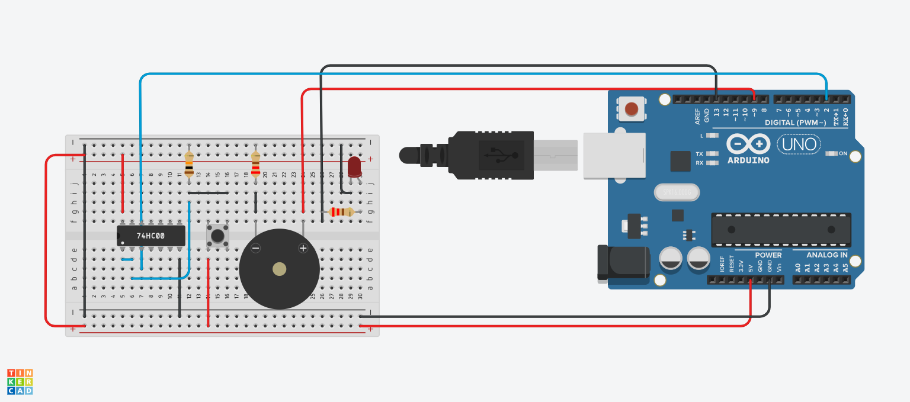
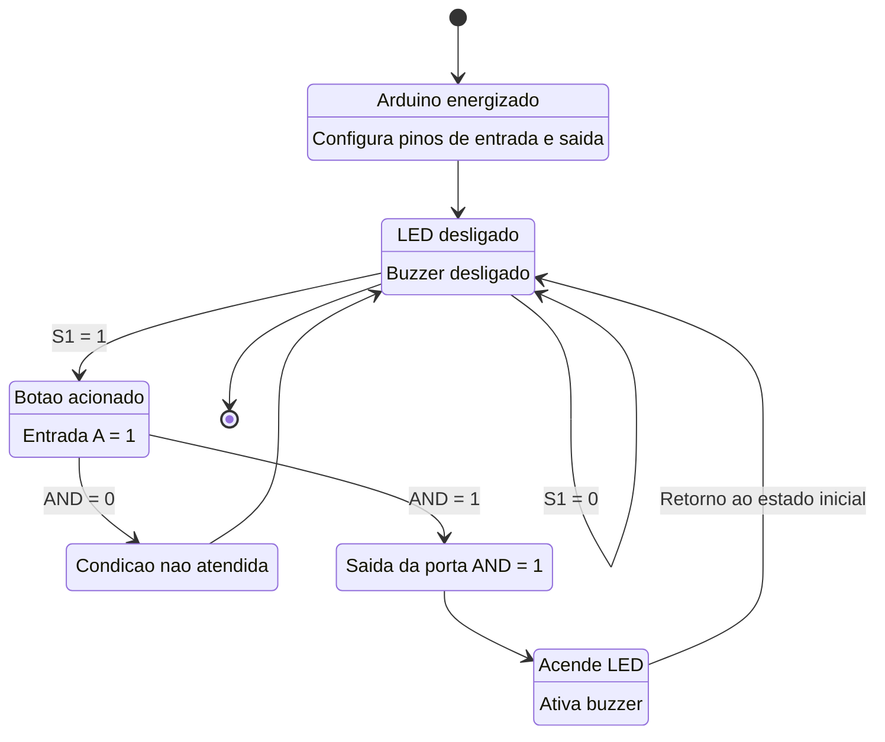

## Descrição do Projeto

Aprenda a tocar uma música usando um arduino



## Links
[TinkerCAD](https://www.tinkercad.com/things/1bnnticSVcp/editel?returnTo=%2Fdashboard&sharecode=ckPfKMS7D0vNUFLqFc6snN5nkZ_8ah2aT9JhWaI_t2A)

[YouTube](https://www.youtube.com/watch?v=OMEhSwFTIdAq)

## Fluxograma em Mermaid



## Código do Arduino

```c
const int buttonPin = 2; 
const int buzzerPin = 9; 
const int ledPin = 13;   

#define NOTE_C4 262
#define NOTE_D4 294
#define NOTE_E4 330
#define NOTE_F4 349
#define NOTE_G4 392
#define NOTE_A4 440
#define NOTE_B4 494
#define NOTE_C5 523
#define NOTE_D5 587
#define NOTE_E5 659
#define REST 0

int pokemon_melodia[] = {
  NOTE_C5, NOTE_G4, NOTE_E4, NOTE_F4, NOTE_G4, NOTE_A4, NOTE_G4, NOTE_F4, NOTE_E4,
  NOTE_D4, NOTE_E4, NOTE_C4, NOTE_G4, NOTE_G4, NOTE_A4, NOTE_G4, NOTE_F4, NOTE_E4,
  NOTE_D5, NOTE_C5, NOTE_D5, NOTE_C5, NOTE_B4, NOTE_A4, NOTE_G4, NOTE_C5, NOTE_B4,
  NOTE_A4, NOTE_G4, NOTE_F4, NOTE_E4, NOTE_D4, NOTE_C4, REST
};

int pokemon_duration[] = {
  8, 8, 8, 8, 8, 8, 8, 8, 4, 8, 8, 8, 8, 8, 8, 8, 8, 4,
  8, 8, 8, 8, 8, 8, 4, 8, 8, 4, 8, 8, 4, 4, 2, 2
};

void setup() {
  pinMode(buttonPin, INPUT_PULLUP); 
  pinMode(buzzerPin, OUTPUT);
  pinMode(ledPin, OUTPUT);
  digitalWrite(ledPin, LOW); 
}

void loop() {

  if (digitalRead(buttonPin) == LOW) {
    digitalWrite(ledPin, HIGH); 

    int notes = sizeof(pokemon_melodia) / sizeof(pokemon_melodia[0]);
    for (int i = 0; i < notes; i++) {

      if (digitalRead(buttonPin) == HIGH) {
        break; 
      }

      int noteDuration = 2000 / pokemon_duration[i];
      if (pokemon_melodia[i] > 0) {
        tone(buzzerPin, pokemon_melodia[i], noteDuration * 0.7);
      }
      delay(noteDuration);
      noTone(buzzerPin);
    }

    digitalWrite(ledPin, LOW); 
  }
}
```

## Lista de componentes

| Nome | Quantidade | Componente |
|---|---|---|
| U1 | 1 |  Arduino Uno R3 |
| PIEZO1 | 1 |  Piezo |
| D1 | 1 | Vermelho LED |
| R1 | 1 | 10 kΩ Resistor |
| R2, R3 | 2 | 220 Ω Resistor |
| S1 | 1 |  Botão |
| U2 | 1 |  Porta quad NAND |