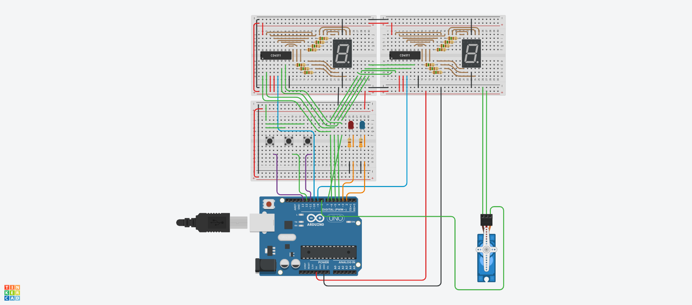
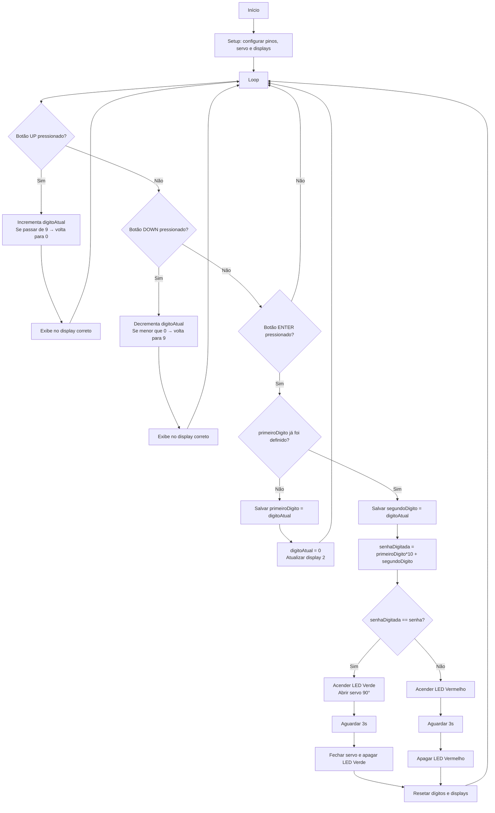

## Descrição do Projeto

Fechadura eletrônica automatizada por senha.



### Links
[TinkerCAD](https://www.tinkercad.com/things/jopJZiPlP8A-grupo-s21-d/editel?returnTo=https%3A%2F%2Fwww.tinkercad.com%2Fdashboard&sharecode=4jNSaxFH2I_HAA3p_Q6voFEMA5iDl-HtAvT1Tg23VhA)

[YouTube](https://www.youtube.com/watch?v=1U_vJeipmOM)


## Fluxograma 
 



## Código do Arduino

```c
#include <Servo.h>

// ==================== CONFIGURAÇÕES ====================

// Senha (2 dígitos)
const int senha = 25;

// Botões
const int btnUp     = 13;
const int btnDown   = 12;
const int btnEnter  = 11;

// LEDs
const int ledVerm   = 3;
const int ledVerde  = 2;

// Linhas A B C D dos CD4511 (COMPARTILHADAS)
const int pinA = 7;
const int pinB = 6;
const int pinC = 5;
const int pinD = 4;

// Latches
const int latch1 = 10; // display 1
const int latch2 = 9;  // display 2

// Servo
Servo servo;
const int servoPin = 8;

// Controle interno
int digitoAtual = 0;
int primeiroDigito = -1;
int segundoDigito = -1;

// Debounce
unsigned long lastPress = 0;
const int debounceTime = 180;

// ==================== FUNÇÃO PARA ATUALIZAR DISPLAY ====================

void setDigit(int display, byte valor) {
  int latchPin = (display == 1 ? latch1 : latch2);

  // libera o latch do display alvo (LOW para escrever)
  digitalWrite(latchPin, LOW);

  // enviar bits
  digitalWrite(pinA, (valor >> 0) & 1);
  digitalWrite(pinB, (valor >> 1) & 1);
  digitalWrite(pinC, (valor >> 2) & 1);
  digitalWrite(pinD, (valor >> 3) & 1);

  delayMicroseconds(300); // estabilização dos sinais

  digitalWrite(latchPin, HIGH); // trava o número
}

// ==================== INICIALIZAÇÃO ====================

void setup() {
  Serial.begin(9600);

  pinMode(btnUp, INPUT_PULLUP);
  pinMode(btnDown, INPUT_PULLUP);
  pinMode(btnEnter, INPUT_PULLUP);

  pinMode(ledVerm, OUTPUT);
  pinMode(ledVerde, OUTPUT);
  digitalWrite(ledVerm, LOW);
  digitalWrite(ledVerde, LOW);

  pinMode(pinA, OUTPUT);
  pinMode(pinB, OUTPUT);
  pinMode(pinC, OUTPUT);
  pinMode(pinD, OUTPUT);

  pinMode(latch1, OUTPUT);
  pinMode(latch2, OUTPUT);

  // Latches devem começar travados
  digitalWrite(latch1, HIGH);
  digitalWrite(latch2, HIGH);

  servo.attach(servoPin);
  servo.write(0); // fechado

  // inicia displays mostrando 0
  setDigit(1, 0);
  setDigit(2, 0);

  Serial.println("Sistema iniciado.");
}

// ==================== LOOP PRINCIPAL ====================

void loop() {

  // ==================== BOTÃO UP ====================
  if (digitalRead(btnUp) == LOW && millis() - lastPress > debounceTime) {
    lastPress = millis();

    digitoAtual++;
    if (digitoAtual > 9) digitoAtual = 0;

    Serial.print("Incrementou para: ");
    Serial.println(digitoAtual);

    // Mostrar no display correto
    if (primeiroDigito == -1)
      setDigit(1, digitoAtual);
    else
      setDigit(2, digitoAtual);
  }

  // ==================== BOTÃO DOWN ====================
  if (digitalRead(btnDown) == LOW && millis() - lastPress > debounceTime) {
    lastPress = millis();

    digitoAtual--;
    if (digitoAtual < 0) digitoAtual = 9;

    Serial.print("Decrementou para: ");
    Serial.println(digitoAtual);

    if (primeiroDigito == -1)
      setDigit(1, digitoAtual);
    else
      setDigit(2, digitoAtual);
  }

  // ==================== BOTÃO ENTER ====================
  if (digitalRead(btnEnter) == LOW && millis() - lastPress > debounceTime) {
    lastPress = millis();

    Serial.println("Confirmou!");

    if (primeiroDigito == -1) {
      primeiroDigito = digitoAtual;
      digitoAtual = 0;
      setDigit(2, digitoAtual); // limpar segundo display para entrada
      Serial.print("Primeiro dígito registrado: ");
      Serial.println(primeiroDigito);
    }

    else if (segundoDigito == -1) {
      segundoDigito = digitoAtual;

      Serial.print("Segundo dígito registrado: ");
      Serial.println(segundoDigito);

      int senhaDigitada = primeiroDigito * 10 + segundoDigito;

      // ========== VERIFICAR SENHA ==========
      if (senhaDigitada == senha) {
        Serial.println("Senha CORRETA!");
        digitalWrite(ledVerde, HIGH);

        servo.write(90);
        delay(3000);

        servo.write(0);
        digitalWrite(ledVerde, LOW);
      } else {
        Serial.println("Senha ERRADA!");
        digitalWrite(ledVerm, HIGH);
        delay(3000);
        digitalWrite(ledVerm, LOW);
      }

      // reset para nova digitação
      digitoAtual = 0;
      primeiroDigito = -1;
      segundoDigito = -1;
      setDigit(1, 0);
      setDigit(2, 0);
    }
  }
}
```

## Lista de componentes

| Nome | Quantidade | Componente |
|---|---|---|
| U1 | 1 |  Arduino Uno R3 |
| Digit1, Digit2 | 2 | Catódica Visor de sete segmentos |
| U2, U3 | 2 |  Decodificador de sete segmentos |
| R1, R2, R3, R4, R5, R6, R7, R8, R9, R10, R11, R12, R13, R14 | 14 | 150 Ω Resistor |
| S1, S3, S2 | 3 |  Botão |
| D1 | 1 | Vermelho LED |
| D2 | 1 | Azul LED |
| R25, R26 | 2 | 330 Ω Resistor |
| SERVO1 | 1 | Posicional Micro servo |