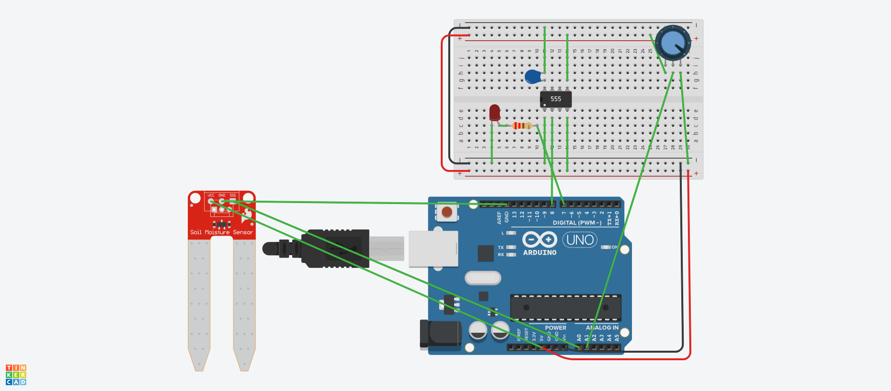

## Descrição do Projeto

**SISTEMA DE IRRIGAÇÃO AUTOMÁTICA**

**Descrição do problema:** A irrigação manual é imprecisa e pode causar falta ou excesso
de água no solo. Isso prejudica o desenvolvimento das plantas e
gera desperdício. Sistemas automáticos de monitoramento
tornam o processo mais eficiente, garantindo irrigação apenas
quando o solo realmente precisa.

**Motivação:** Criar uma solução simples e acessível que mostre, na prática,
como sensores e microcontroladores podem automatizar tarefas
do dia a dia e melhorar o uso da água.



## Links
[TinkerCAD](https://www.tinkercad.com/things/0lxEQY6kPUZ-funky-fulffy/editel?returnTo=%2Fthings%2F0lxEQY6kPUZ-funky-fulffy&sharecode=ULo90ps93vIx5pKI-wng9aKjlzD96TjA6hq9Qm_Obdc)

[YouTube](https://www.youtube.com/watch?v=fq9T59H-RDk)


## Código do Arduino

```c
const int sensorPin = A0;   // sensor de umidade
const int potPin    = A1;   // potenciômetro
const int trigPin   = 8;    // trigger do CI 555
const int ledPin    = 7;    // LED indicador

void setup() {
  pinMode(trigPin, OUTPUT);
  pinMode(ledPin, OUTPUT);
  digitalWrite(trigPin, HIGH); // padrão alto para o 555
  digitalWrite(ledPin, LOW);
  Serial.begin(9600);
}

void loop() {
  int umidade = analogRead(sensorPin); // leitura do sensor
  int limiar  = analogRead(potPin);    // leitura do potenciômetro

  Serial.print("Umidade: ");
  Serial.print(umidade);
  Serial.print(" | Limiar: ");
  Serial.println(limiar);

  // solo seco → aciona
  if (umidade < limiar) {
    digitalWrite(ledPin, HIGH);
    digitalWrite(trigPin, LOW);   // trigger do 555
    delay(120);
    digitalWrite(trigPin, HIGH);
    delay(2000);                  // tempo entre acionamentos
  } else {
    digitalWrite(ledPin, LOW);
  }

  delay(500);
}
```

## Lista de componentes

| Nome | Quantidade | Componente |
|---|---|---|
| Rpot1 | 1 | 10 kΩ Potenciômetro |
| D1 | 1 | Vermelho LED |
| U3 | 1 |  Arduino Uno R3 |
| U4 | 1 |  Cronômetro |
| SEN1 | 1 |  Sensor de umidade do solo |
| R1 | 1 | 220 Ω Resistor |
| C1 | 1 | 100 nF Capacitor |