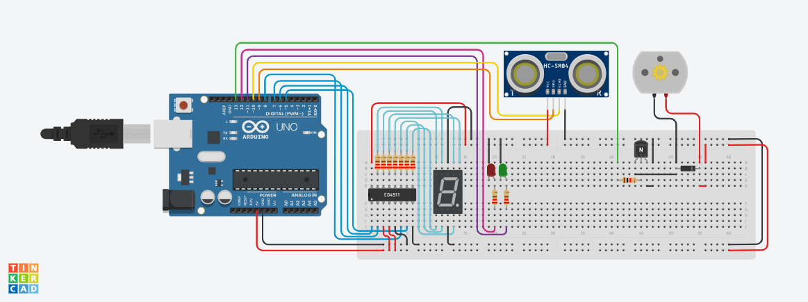
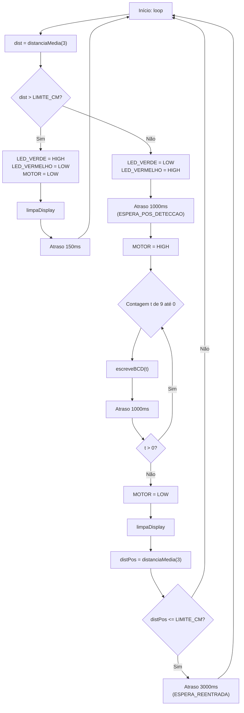

## Descrição do Projeto

Nosso projeto é um Bebedouro com um sensor de aproximação. Ao aproximar o copo do sensor ele mudará o LED indicativo, ligará a bomba de água e começará a contagem no display de 9 até 0.

Utilizamos todos os critérios passados pelo professor:
Utilizamos um sensor de distância ultrasonico (HC-SR04), assim como um CI decotificador (CD4511) para instalação do display de sete segmentos que é uma das nossas saídas, além de claro, a bomba, utilisamos o Arduino Uno R3 para fazer o controle do sistema do projeto. Após essas considerações, fizemos a simulação no ThinkerCAD e montamos o projeto físico, então por último, fizemos um vídeo explicativo do nosso projeto.



## Links
[TinkerCAD](https://www.tinkercad.com/things/4P8AJyjVY7f-grupo-s21-h/editel?returnTo=https%3A%2F%2Fwww.tinkercad.com%2Fdashboard&sharecode=w669nUZbl7ghV0WBgWE0CEwW0OujkGFaGAcf8uWHZCU)

[YouTube](https://youtu.be/J20hsn5bg9U)

## Fluxograma em Mermaid

- https://mermaid.live/
- [State diagrams](https://mermaid.js.org/syntax/stateDiagram.html)



## Código do Arduino
```c
#define MOTOR 13
#define LED_VERDE 11
#define LED_VERMELHO 12

#define BCD_A 5
#define BCD_B 6
#define BCD_C 7
#define BCD_D 8

#define TRIG 9
#define ECHO 10

const float LIMITE_CM = 15.0;
const int TEMPO_FLUXO = 9;
const int ESPERA_POS_DETECCAO_MS = 1000;
const int ESPERA_REENTRADA_MS = 3000;

void escreveBCD(int n) {
  n = constrain(n, 0, 9);
  digitalWrite(BCD_A, (n >> 0) & 1);
  digitalWrite(BCD_B, (n >> 1) & 1);
  digitalWrite(BCD_C, (n >> 2) & 1);
  digitalWrite(BCD_D, (n >> 3) & 1);
}

void limpaDisplay() {
  escreveBCD(0);
  digitalWrite(BCD_A, LOW);
  digitalWrite(BCD_B, LOW);
  digitalWrite(BCD_C, LOW);
  digitalWrite(BCD_D, LOW);
}

float leituraUltrassonicaUmaLeitura(unsigned long timeout_us = 25000UL) {
  digitalWrite(TRIG, LOW);
  delayMicroseconds(2);
  digitalWrite(TRIG, HIGH);
  delayMicroseconds(10);
  digitalWrite(TRIG, LOW);

  unsigned long duracao = pulseIn(ECHO, HIGH, timeout_us);
  if (duracao == 0) return 999.0;
  return duracao * 0.0343f / 2.0f;
}

float distanciaMedia(int amostras = 3, unsigned long timeout_us = 25000UL) {
  float soma = 0.0;
  int validas = 0;
  for (int i = 0; i < amostras; i++) {
    float d = leituraUltrassonicaUmaLeitura(timeout_us);
    if (d < 900.0) {
      soma += d;
      validas++;
    }
    delay(20);
  }
  if (validas == 0) return 999.0;
  return soma / validas;
}

void setup() {
  pinMode(MOTOR, OUTPUT);
  pinMode(LED_VERDE, OUTPUT);
  pinMode(LED_VERMELHO, OUTPUT);

  pinMode(BCD_A, OUTPUT);
  pinMode(BCD_B, OUTPUT);
  pinMode(BCD_C, OUTPUT);
  pinMode(BCD_D, OUTPUT);

  pinMode(TRIG, OUTPUT);
  pinMode(ECHO, INPUT);

  digitalWrite(MOTOR, LOW);
  digitalWrite(LED_VERDE, HIGH);
  digitalWrite(LED_VERMELHO, LOW);
  limpaDisplay();

  Serial.begin(9600);
  Serial.println("Sistema inicializado");
}

void loop() {
  float dist = distanciaMedia(3);
  Serial.print("Distancia (cm): ");
  Serial.println(dist);

  if (dist > LIMITE_CM) {
    digitalWrite(LED_VERDE, HIGH);
    digitalWrite(LED_VERMELHO, LOW);
    digitalWrite(MOTOR, LOW);
    limpaDisplay();
    delay(150);
    return;
  }

  digitalWrite(LED_VERDE, LOW);
  digitalWrite(LED_VERMELHO, HIGH);

  delay(ESPERA_POS_DETECCAO_MS);
  digitalWrite(MOTOR, HIGH);

  for (int t = TEMPO_FLUXO; t >= 0; t--) {
    escreveBCD(t);
    Serial.print("Contagem: ");
    Serial.println(t);
    delay(1000);
  }

  digitalWrite(MOTOR, LOW);
  limpaDisplay();

  float distPos = distanciaMedia(3);
  Serial.print("Dist após fluxo (cm): ");
  Serial.println(distPos);
  if (distPos <= LIMITE_CM) {
    Serial.println("Objeto ainda presente -> aguardando 3s");
    delay(ESPERA_REENTRADA_MS);
  }
}
```

## Lista de componentes

| Nome | Quantidade | Componente |
|---|---|---|
| U3 | 1 | Arduino Uno R3 |
| U4 | 1 | Decodificador de sete segmentos |
| R11, R12, R13, R14, R15, R16, R17, R18, R19 | 9 | 220 Ω Resistor |
| Digit2 | 1 | Catódica Visor de sete segmentos |
| DIST2 | 1 | Sensor de distância ultrassônico (quatro pinos) |
| D5 | 1 | Verde LED |
| D4 | 1 | Vermelho LED |
| R20 | 1 | 1 kΩ Resistor |
| T2 | 1 | Transistor NPN (BJT) |
| D6 | 1 | Diodo |
| M2 | 1 | Motor CC |
