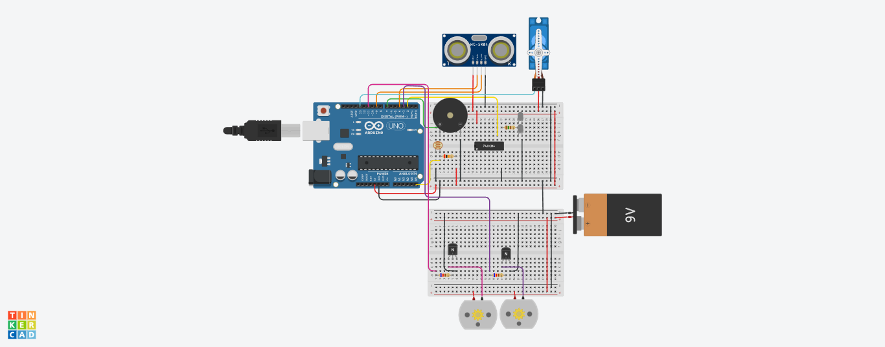
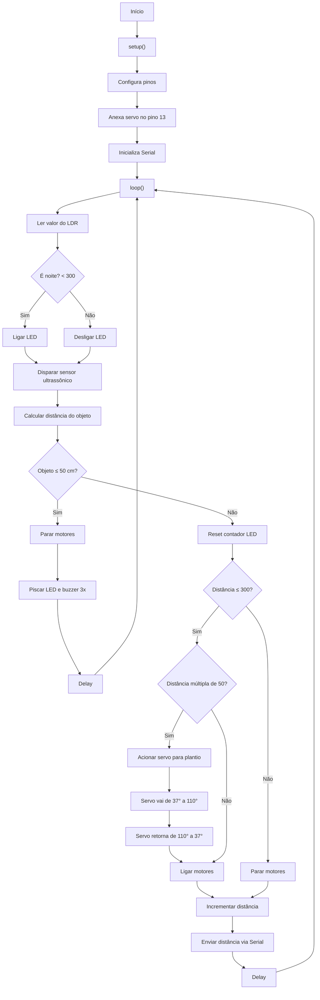

## Descrição do Projeto
Trator com plantadeira autônoma controlado por Arduino, capaz de realizar o plantio automático, operar à noite e parar por segurança ao detectar obstáculos.



## Links
[TinkerCAD](https://www.tinkercad.com/things/9NdJrxBrmlD-grupo-s21-i/editel?returnTo=%2Fthings%2F9NdJrxBrmlD-grupo-s21-i)


[YouTube](https://www.youtube.com/watch?v=DndeYzf7MWc)

## Fluxograma em Mermaid

- https://mermaid.live/
- [State diagrams](https://mermaid.js.org/syntax/stateDiagram.html)



## Código do Arduino

```c
#include "Servo.h"

Servo servomotor;

int motor_esquerdo = 3;
int motor_direito = 11;
int led = 2;
int ldr = A5;
int buzzer = 7;
int trig = 4;
int echo = 9;

float objeto;
unsigned long duracao;
int distancia = 0;
int ldrvalor = 0;
int posicao = 37;
int contador_led = 0;

void setup() {
  pinMode(led, OUTPUT);
  pinMode(buzzer, OUTPUT);
  pinMode(motor_esquerdo, OUTPUT);
  pinMode(motor_direito, OUTPUT);
  pinMode(trig, OUTPUT);
  pinMode(echo, INPUT);

  servomotor.attach(13);

  Serial.begin(9600);
}

void loop() {
  // Acender a luz em caso de noite
  ldrvalor = analogRead(ldr);
  if (ldrvalor >= 300) {
    digitalWrite(led, LOW);
  } else {
    digitalWrite(led, HIGH);
  }

  // Medir a distância do objeto
  digitalWrite(trig, HIGH);
  delayMicroseconds(10);
  digitalWrite(trig, LOW);
  duracao = pulseIn(echo, HIGH,11764);
  objeto = duracao / 58.0;

  if (objeto <= 50 && objeto != 0) {
    analogWrite(motor_esquerdo, 0);
    analogWrite(motor_direito, 0);
    for (contador_led == 0; contador_led < 3; contador_led++) {
      digitalWrite(led, HIGH);
      delay(500);
      digitalWrite(led, LOW);
      digitalWrite(buzzer, HIGH);
      delay(500);
      digitalWrite(buzzer, LOW);
    }
    delay(100);  
  } else {
    contador_led = 0;

    // Funcionar o motor responsável por girar as rodas
    if (distancia <= 300) {

      // Funcionar o motor responsável por plantar a cada 0,5 m
      if (distancia % 50 == 0 && distancia != 0) {
        for (posicao = 37; posicao <= 110; posicao += 1) {
          servomotor.write(posicao);
          analogWrite(motor_direito, 0);
          analogWrite(motor_esquerdo, 0);
          delay(15); 
        }
        for (posicao = 110; posicao >= 37; posicao -= 1) {
          servomotor.write(posicao);
          analogWrite(motor_direito, 0);
          analogWrite(motor_esquerdo, 0);
          delay(15); 
        }
      }
      analogWrite(motor_direito, 127);
      analogWrite(motor_esquerdo, 127);
      delay(20);
      analogWrite(motor_esquerdo, 127);
      analogWrite(motor_direito, 75);
    } else {
      analogWrite(motor_direito, 0);
      analogWrite(motor_esquerdo, 0);
    }
  }

  // Calcula a distância
  distancia = distancia + 1;
  Serial.println(distancia);
  delay(10);
}
```

## Lista de componentes

| Nome | Quantidade | Componente |
| --- | --- | --- |
| BAT1 | 1 | Bateria 9V |
| D1, D2 | 2 | Branco LED |
| PIEZO1 | 1 | Piezo |
| R1 | 1 | Fotorresistor |
| SERVO1 | 1 | Posicional Micro servo |
| U1 | 1 | Arduino Uno R3 |
| R2 | 1 | 20 kΩ Resistor |
| R4 | 1 | 150 Ω Resistor |
| DIST3 | 1 | Sensor de distância ultrassônico (quatro pinos) |
| R9, R3 | 2 | 620 Ω Resistor |
| T2, T1 | 2 | Transistor NPN (BJT) |
| M2, M3 | 2 | Motor CC |
| U2 | 1 | Inversor hexadecimal |