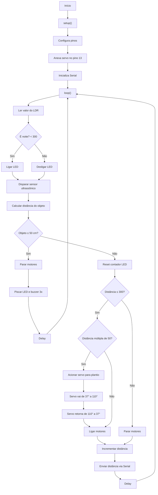

## Descrição do Projeto
Trator com plantadeira autônoma controlado por Arduino, capaz de realizar o plantio automático, operar à noite e parar por segurança ao detectar obstáculos.

## Links
[TinkerCAD](https://www.tinkercad.com/things/9NdJrxBrmlD-grupo-s21-i/editel?returnTo=%2Fthings%2F9NdJrxBrmlD-grupo-s21-i)

[YouTube](https://www.youtube.com/watch?v=DndeYzf7MWc)

## Fluxograma em Mermaid

- https://mermaid.live/
- [State diagrams](https://mermaid.js.org/syntax/stateDiagram.html)

## Lista de componentes

| Nome | Quantidade | Componente |
| --- | --- | --- |
| BAT1 | 1 | Bateria 9V |
| D1, D2 | 2 | Branco LED |
| PIEZO1 | 1 | Piezo |
| R1 | 1 | Fotorresistor |
| SERVO1 | 1 | Posicional Micro servo |
| U1 | 1 | Arduino Uno R3 |
| R2 | 1 | 20 kΩ Resistor |
| R4 | 1 | 150 Ω Resistor |
| DIST3 | 1 | Sensor de distância ultrassônico (quatro pinos) |
| R9, R3 | 2 | 620 Ω Resistor |
| T2, T1 | 2 | Transistor NPN (BJT) |
| M2, M3 | 2 | Motor CC |
| U2 | 1 | Inversor hexadecimal |