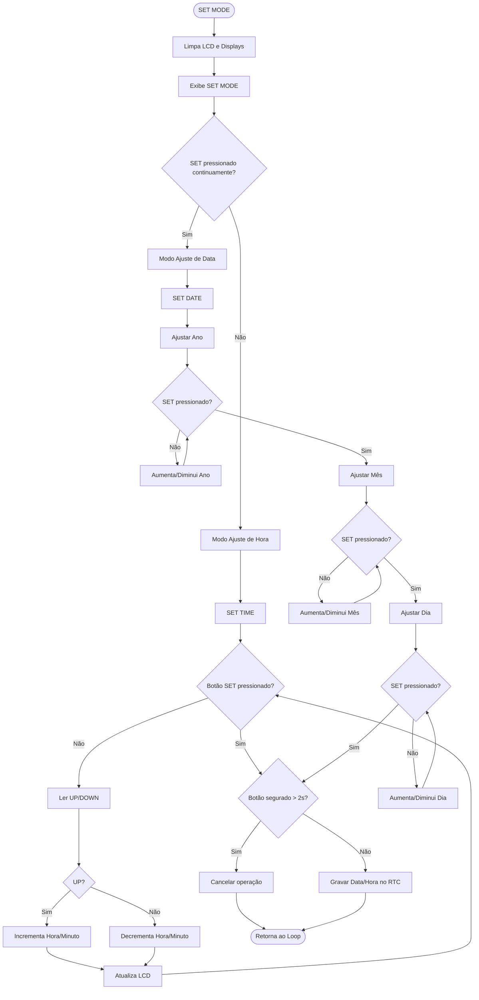
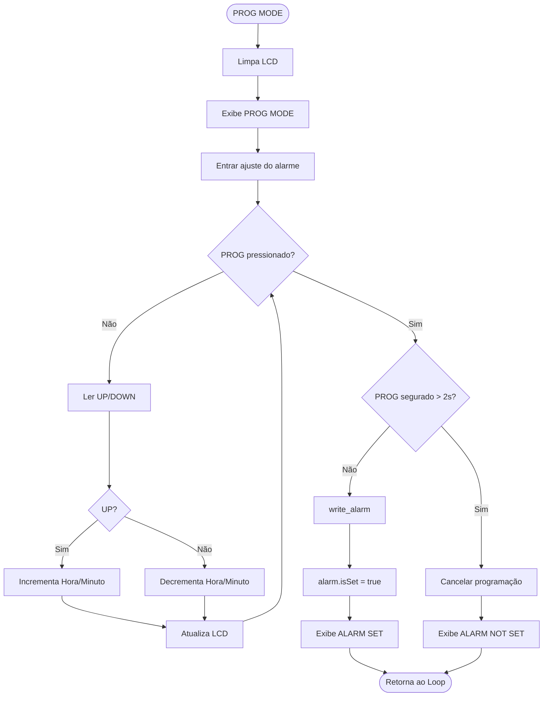
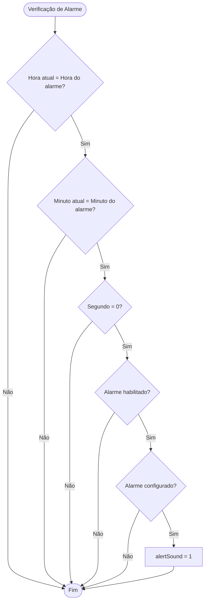
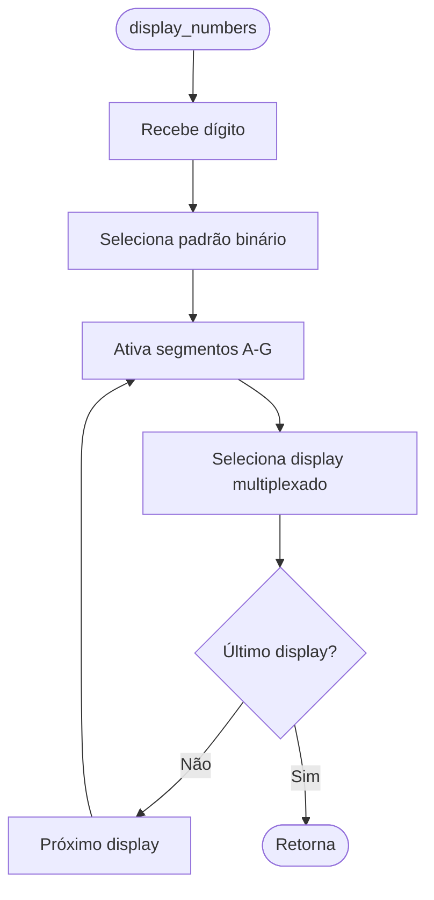

## Descrição do Projeto

O objetivo do projeto é criar um despertador microcontrolado, utilizando um Arduino MEGA. O despertador possui funções de contagem de tempo, programação de um alarme customizado e configuração de um novo horário pelo usuário. Além disso, o despertador conta com uma tela de LCD, para mostrar ao usuário informações de data, hora, se o alarme está ativado ou não e temperatura ambiente.
O Projeto baseia-se no módulo RTC DS1302, que realiza a tarefa de armazenar o tempo configurado e o tempo em que o alarme deverá ser tocado. Essas informações são memorizadas nele por conta de sua função de dupla alimentação, ou seja, quando a fonte de tensão principal é desligada, ele continua operando normalmente e armazenando armazenando o que foi registrado, garantindo a confiabilidade do sistema. Além disso, foram utilizados:

* Quatro Displays de Sete Segmentos multiplexados, para mostrar o horário atual.
* Um Display LCD, para mostrar informações complementares;
* Um multiplexador de entradas para os 7 botões e chaves seletoras;
* Um módulo LM35 para coletar informações de temperatura ambiente.

O usuário possui funções para:
* Configuração da data e hora atuais, registrando as informações de ano, mês, dia, hora e minuto;
* Configuração de um alarme, informando a hora e minuto em que o alarme deverá tocar;
* Desativação do alarme por chave seletora, em que caso ela estivar desativada, o alarme não irá tocar.


## Links
[Vídeo Explicativo.](https://www.youtube.com/watch?v=sfh_pH4y7nc)

## Simulação

Para simular, utilizou-se o Proteus 8 Professional. Você pode simular o  projeto utilizando esse [arquivo](./Esquema%20Elétrico%20-%20Projeto%20Final.pdsprj).
Lembre-se de editar, nas propriedades do Arduino Mega, o local do código a ser executado. Para isso, compile o código na Arduino IDE e cole o caminho correspondente ao código .HEX gerado, no campo correto do Proteus. Em caso de dúvida, segue um [Tutorial de configuração do Proteus](https://www.youtube.com/watch?v=PeKZJ-kdcGs).
## Fluxograma em Mermaid

### Função Setup

```mermaid
---
config:
  layout: elk
  theme: mc
---
flowchart TD
    A([INÍCIO])
    A --> B["setup()"]
    B --> B1[Inicializa Serial]
    B1 --> B2[Inicializa LCD]
    B2 --> B3[Inicializa RTC]
    B3 --> B4[Configura pinos]
    B4 --> B5[Inicializa variáveis]
    B5 --> B6{Alarme salvo na RAM?}
    B6 -->|Sim| B7[read_alarm + save_alarm]
    B6 -->|Não| B8[Zera estrutura de alarme]
    B7 --> MAIN
    B8 --> MAIN
    MAIN[[LOOP PRINCIPAL]]
    MAIN --> L1[Ler RTC]
    L1 --> L2{Mudou segundo?}
    L2 -->|Sim| L3[update_time_RTC]
    L2 -->|Não| L4[ ]
    L3 --> L4
    L4 --> L5{Mudou dia?}
    L5 -->|Sim| L6[update_date_LCD]
    L5 -->|Não| L7[ ]
    L6 --> L7
    L7 --> L8[Verificar SET e PROG]
    L8 --> L9{SET pressionado?}
    L9 -->|Sim| SMODE
    L9 -->|Não| L10[ ]
    L10 --> L11{PROG pressionado?}
    L11 -->|Sim| PMODE
    L11 -->|Não| L12[ ]
    SMODE --> L12
    PMODE --> L12
    L12 --> L13{ALM_ACT mudou?}
    L13 -->|Sim| L14[alm_active]
    L13 -->|Não| L15[ ]
    L14 --> L15
    L15 --> L16{ALM_OFF pressionado?}
    L16 -->|Sim| L17[Desliga buzzer]
    L16 -->|Não| L18[ ]
    L17 --> L18
    L18 --> L19{Hora atual = hora do alarme?}
    L19 -->|Sim| L20{Alarme ativo?}
    L20 -->|Sim| L21[alertSound = 1]
    L20 -->|Não| L22[ ]
    L19 -->|Não| L22
    L21 --> L22
    L22 --> L23{alertSound?}
    L23 -->|Sim| L24[Liga buzzer]
    L23 -->|Não| L25[Desliga buzzer]
    L24 --> L26[ ]
    L25 --> L26
    L26 --> L27{30 segundos passaram?}
    L27 -->|Sim| L28[update_info_LCD]
    L27 -->|Não| L29[ ]
    L28 --> L29
    L29 --> L30[Atualiza displays multiplexados]
    L30 --> MAIN
    SMODE[[SET MODE]]
    PMODE[[PROG MODE]]
    classDef setupNode stroke:#818cf8,fill:#eef2ff
    classDef loopNode stroke:#2dd4bf,fill:#f0fdfa
    classDef checkNode stroke:#a78bfa,fill:#f5f3ff
    classDef actionNode stroke:#fb923c,fill:#fff7ed
    classDef modeNode stroke:#e879f9,fill:#fdf4ff
    class B,B1,B2,B3,B4,B5 setupNode
    class MAIN loopNode
    class B6,L2,L5,L9,L11,L13,L16,L19,L20,L23,L27 checkNode
    class B7,B8,L3,L6,L14,L17,L21,L24,L25,L28,L30 actionNode
    class SMODE,PMODE modeNode

```


### Subprocesso SET MODE


### Subprocesso PROG MODE


### Subprocesso ACIONAMENTO DO ALARME


### Subprocesso DISPLAY DE SETE SEGMENTOS



## Código do Arduino

```c
// DISCIPLINA: SISTEMAS DIGITAIS
// PROFESSOR: ADRIANO RUSELER
// TURMA: S21
// ALUNOS: ALFONSO ALBA, GUSTAVO MÜLBAUER, JOÃO GOMES

// PROJETO: DESPERTADOR DIGITAL MICROCONTROLADO
// LÓGICA DE PROGRAMAÇÃO EM C

#include <RtcDS1302.h> // Inclui Biblioteca "RTCbyMakuna". Disponível em: https://docs.arduino.cc/libraries/rtc-by-makuna/
#include <LiquidCrystal.h> // Inclui Biblioteca "LiquidCrystal". Disponível em: https://docs.arduino.cc/libraries/liquidcrystal/
#include <LM35.h> // Inclui biblioteca "LM35 Sensor". Disponível em: https://github.com/wilmouths/LM35
#include <string.h> // Inclui biblioteca "String". Biblioteca padrão da Linguagem C.

// PINOS RTC.
#define ENA_RTC 40
#define CLK_RTC 41
#define DATA_RTC 42

// PINOS LCD.
#define RS_LCD 34
#define EN_LCD 35
#define D4_LCD 36
#define D5_LCD 37
#define D6_LCD 38
#define D7_LCD 39

//PINOS DISPLAY DE SETE SEGMENTOS.
#define D1_D7S 29 // PRIMEIRO PINO DE ATIVAÇÃO (DISPLAYS SÃO MULTIPLEXADOS).
#define DISPLAY_QTD 4 // QUANTIDADE DE DISPLAYS.
const byte PINOS_D7S[] = {22, 23, 24, 25, 26, 27, 28}; // PINOS DOS SEGMENTOS.

// PINO INDICADOR DE SEGUNDOS.
#define LED_BLINK 33 

// PINOS MULTIPLEXADOR DE ENTRADAS.
#define BUTTON_INPUT 46
const byte PINOS_MUX[] = {43, 44, 45};

// PINO DO BUZZER.
#define BUZZER 47

// PINO DO SENSOR DE TEMPERATURA
#define TEMPSENSOR A0

// INDEX DOS BOTOES.
#define ALM_OFF 1
#define SET 2
#define PROG 3
#define ALM_ACT 4
#define UPORDOWN 5
#define HOUR 6
#define MINUTE 7

struct alarm_time { // Estrutura de dados para o alarme.
  int hour;
  int minute;
  bool isSet; // Booleano para identificar se o alarme está ativado.
};
alarm_time alarm; // Variavel de armazenamento do tempo de alarme.

struct time_to_set // Estrutura de dados para o tempo a ser inserido RTC.
{
  int hour;
  int minute;
  int second;
  int date[3]; // Ordem de date[]: Ano, Mês, Dia.
};
time_to_set timeSet; // Variável para armazenar o tempo a ser inserido no RTC.

int time_7sd[] = {0,0,0,0}; // Array para armazenar os caracteres do D7S. Ordem de time_7sd[]: {H,H,M,M}
int cycle_counter = 0; // Contador de ciclos para o indicador de segundos.
int last_second = 0; // Último segundo recebido.
int last_day = 0; // Último dia recebido.
int alertSound = 0; // Variável que toca o Buzzer
int CONTROL_TEMP = 0; // Variável de controle da temperatura.
int CONTROL_ALARM = 0; // Variável de controle do buzzer. Caso estiver em 0, o buzzer não irá acionar no tempo de alarme.
char alarmText[6]; // Variável que armazena a informação recebida do RTC.

const char* WeekDays[] = // Array de dias da semana.
{
  "Domingo",
  "Segunda",
  "Terca",
  "Quarta",
  "Quinta",
  "Sexta",
  "Sabado"
};

ThreeWire myWire(DATA_RTC, CLK_RTC, ENA_RTC); // Constructor para a instância do RTC.

RtcDS1302<ThreeWire> RTC(myWire); // INSTÂNCIA DO RTC.
LiquidCrystal LCD(RS_LCD, EN_LCD, D4_LCD, D5_LCD, D6_LCD, D7_LCD); // INSTÂNCIA DO LCD.
LM35 TempSensor(TEMPSENSOR); // INSTÂNCIA DO LM35

void setup() // Inicialização de variáveis, I/O e módulos.
{
  Serial.begin(4800); // Inicia comunicação Serial.

  LCD.begin(16,2); // Inicia o LCD.
  RTC.Begin(); // Inicia o RTC.

  RTC.SetIsWriteProtected(false); // Habilita escrita na memória do RTC.
  RTC.SetIsRunning(true); // Habilita clock do RTC.

  for(int i = 22; i <=33; i++) // Define os pinos do D7S como output.
  {
    pinMode(i, OUTPUT);
  }

  for(int i = 0; i < 3; i++) // Define os pinos ABC do Multiplexador como output.
  {
    pinMode(PINOS_MUX[i], OUTPUT);
  }

  pinMode(BUTTON_INPUT, INPUT); // Define o pino Y do Multiplexador como input.
  pinMode(BUZZER, OUTPUT); // Define o pino do Buzzer como Output.

  // Variáveis para configurar a data e hora do RTC.
  timeSet.hour = 0;
  timeSet.minute = 0;
  timeSet.second = 0;
  for (int i = 0; i < 3; i++)
  {
    timeSet.date[i] = 0;
  }

  // Leitura da memória do RTC:
  if (read_alarm() == true) // Caso haja um alarme registrado na RAM do RTC, irá salvar na variável interna.
  {
    save_alarm();
  }
  else // Caso não haja um alarme registrado na RAM do RTC, irá zerar valores e desativar o alarme (NOT SET).
  {
    alarm.hour = 0; 
    alarm.minute = 0;
    alarm.isSet = false; 
  }

}
void loop() // Loop principal.
{
  RtcDateTime now = RTC.GetDateTime(); // Recebe informações armazenadas no RTC. 

  if (last_second != now.Second()) // Se houve mudança de segundos. 
  {
    last_second = now.Second(); // Atualiza valor de segundo.
    update_time_RTC(now.Hour(), now.Minute()); // Chama função que atualiza os D7S.
    CONTROL_TEMP++; // Incrementa CONTROL_TEMP.
  }

  if (last_day != now.Day()) // Se houve mudança de dias. 
  {
    last_day = now.Day(); // Atualiza o valor do dia.
    update_date_LCD(now.Day(), now.Month(), now.Year(), now.DayOfWeek()); // Atualiza a data no display LCD.
  }

  for(int i = SET; i <= PROG; i++) // Verifica se o usuário deseja mudar alguma configuração.
  {
    if(MUX_input(i) == 1) // Itera para todos os inputs
    {
      last_day = 0; // Muda last_day para 0. Garante que, no próximo loop, a data volte a ser mostrada. 
      user_input(i); // Chama função de tratamento de input.
      delay(200); // Debounce.
    }
  }
  
  if(MUX_input(ALM_ACT) != CONTROL_ALARM) // Verifica se o botão ALM_ACT mudou de estado.
  {
    last_day = 0; // Muda last_day para 0. Garante que, no próximo loop, a data volte a ser mostrada. 
    alm_active(MUX_input(ALM_ACT), alarm.isSet); // Mostra no LCD se o alarme está ativo ou não (Estados: ON, OFF ou NOT SET).
  }

  if(MUX_input(ALM_OFF) == 1) // Botão que desliga o aviso sonoro.
  {
    alertSound = 0;
  }

  if(alarm.hour == now.Hour() && alarm.minute == now.Minute() && now.Second() == 0 && CONTROL_ALARM == 1 && alarm.isSet == true) 
  { // Caso chegue no horário definido e o alarme esteja habilitado e setado, muda o estado da variável de aviso sonoro.
    alertSound = 1;
  }

  if(alertSound == 1) // Toca o aviso sonoro.
  {
    digitalWrite(BUZZER, HIGH);
  }
  else
  {
    digitalWrite(BUZZER, LOW);
  }

  if(CONTROL_TEMP > 30) // A cada 30 segundos, atualiza as informações do LCD, a fim de manter a temperatura atualizada. 
  {
    update_info_LCD(CONTROL_ALARM, alarm.isSet, (int) TempSensor.getTemp(CELCIUS)); // Atualiza as informações do LCD.
    CONTROL_TEMP = 0;
  }

  for(int i = 0; i<4; i++) // Atualiza os displays de sete segmentos multiplexados. Sempre por último no código.
  {
    display_numbers(time_7sd[i], i); //Chama a função de Display.
    delay(4); // Delay de exibição.
  }

}
void update_time_RTC(int hour, int minute) // Atualiza o array a ser exibido nos D7S. XX
{
  digitalWrite(LED_BLINK, HIGH); // A cada mudança de segundo, ativa o LED indicador de segundos.
  cycle_counter = 0; // Reseta a variável de controle do LED indicador de segundos.

  // Atualizam os valores da variável time_7sd[]. Separa os dígitos, caso os números sejam maiores que 10, para cada display.
  if(hour < 10)
  {
    time_7sd[0] = 0;
    time_7sd[1] = hour;
  }
  else
  {
    time_7sd[0] = hour / 10; 
    time_7sd[1] = hour % 10;
  }
  
  if(minute < 10)
  {
    time_7sd[2] = 0;
    time_7sd[3] = minute;
  }
  else
  {
    time_7sd[2] = minute / 10;
    time_7sd[3] = minute % 10;
  }
}
void display_numbers(int number, int display_index) // Exibe os números nos D7S multiplexados.
{
  byte displayNumber = 0b00000000; // Variável para armazenar os estados dos segmentos.
  cycle_counter++; // Utilizado para desativar o LED indicador de segundos. 
  
  if(cycle_counter > 100) // Após 100 ciclos de atualização dos displays de sete segmentos, desativa o LED indicador de segundos (Aprox. 400ms ativado).
  {
    digitalWrite(LED_BLINK, LOW);
  }

  switch(number) // Seleciona quais segmentos serão ligados e carrega-os na variável displayNumber.
  {
    // Segue a ordem: {DP, G, F, E, D, C, B, A}.
    // Caso haja algum erro, irá mostrar "E".
    case 0:
      displayNumber = 0b00111111;
      break;
    case 1:
      displayNumber = 0b00000110;
      break;
    case 2:
      displayNumber = 0b01011011;
      break;
    case 3:
      displayNumber = 0b01001111;
      break;
    case 4:
      displayNumber = 0b01100110;
      break;
    case 5:
      displayNumber = 0b01101101;
      break;
    case 6:
      displayNumber = 0b01111101;
      break;
    case 7:
      displayNumber = 0b00000111;
      break;
    case 8:
      displayNumber = 0b01111111;
      break;
    case 9:
      displayNumber = 0b01101111;
      break;
    case 10: // Desliga todos os segmentos
      displayNumber = 0b00000000;
      break;     
    default:
      displayNumber = 0b01111001;
      break;
  }
  
  for(int i = 0; i <= sizeof(PINOS_D7S)/sizeof(PINOS_D7S[0]); i++) // Ativa os segmentos com nível alto em displayNumber.
  {
    digitalWrite(PINOS_D7S[i], bitRead(displayNumber, i));
  }


  for(int i = 0; i < DISPLAY_QTD; i++) // Liga somente o display indicado.
  {
    if(i == display_index)
    {
      digitalWrite(D1_D7S+i, HIGH);
    }
    else
    {
      digitalWrite(D1_D7S+i, LOW);
    }
  }
  
}
void clear_D7S() // Limpa os displays de sete segmentos.
{
  display_numbers(10, 0);
}
int MUX_input(int position) // Funcão para receber input do Multiplexador.
{
  position--; // Recebemos os valores de 1 a 8. Para iterar, é necessário decrementar para 0 a 7.
  
  for (int i = 0; i < 3; i++) // Define os valores de ABC do Multiplexador para corresponder ao input desejado.
  {
    digitalWrite(PINOS_MUX[i], bitRead(position, i));
  }

  return digitalRead(BUTTON_INPUT); // Retorna a leitura do pino Y do Multiplexador.
}
void update_date_LCD(int day, int month, int year, int dow) // Mostra a data no LCD  
{
  char dateTextBuffer[20]; // Variável para armazenar o dia da semana a ser exibido no LCD.
  char dateNumberBuffer[20]; // Variável para armazenar o dia do mês a ser exibido no LCD.

  snprintf(dateTextBuffer, sizeof(dateTextBuffer), "%s", WeekDays[dow]); // Monta a string do dia da semana.
  snprintf(dateNumberBuffer, sizeof(dateNumberBuffer), "%02d/%02d/%02d", day, month, year % 100); // Monta a string do dia do mês.

  LCD.setCursor(0, 0);
  LCD.print(dateTextBuffer); // Exibe o texto no LCD.
  print_blank_LCD(dateTextBuffer, dateNumberBuffer); // Exibe uma quantia variável de espaços em branco no LCD, para manter o alinhamento da informação.
  LCD.print(dateNumberBuffer); // Exibe a data no LCD.
  update_info_LCD(CONTROL_ALARM, alarm.isSet, (int) TempSensor.getTemp(CELCIUS)); // Atualiza as outras informações no LCD.
}
void update_info_LCD(int CONTROL_ALARM, int isSet, int temperature) // Mostra informações de alarme e temperatura no LCD.
{
  char tempText[10]; // Variável para armazenar o texto da temperatura.
  char alarmText[17]; // Variável para armazenar o texto do alarme.

  snprintf(tempText, sizeof(tempText), "%02dC", temperature); // Monta a string da temperatura.

  LCD.setCursor(0,1); // Muda o cursor do LCD para a segunda linha.
  
  if (isSet == 1) // Verifica se o alarme está setado.
  {
    switch (CONTROL_ALARM) // Verifica se o alarme está habilitado.
    {
      case 0: // Caso o alarme não esteja habilitado, irá mostrar "ALM:OFF", espaços em branco para centralizar, e a temperatura.
        LCD.print("ALM:OFF"); 
        print_blank_LCD("ALM:OFF", "00C");
        LCD.print(tempText);
        break;
      case 1: // Caso o alarme esteja habilitado, irá mostrar "ALM:", o tempo do alarme, espaços em branco para centralizar, e a temperatura.
        snprintf(alarmText, sizeof(alarmText), "ALM %02d:%02d", alarm.hour, alarm.minute);
        LCD.print(alarmText);
        print_blank_LCD("ALM 00:00", "00C");
        LCD.print(tempText);
        break;
      default:
        break;
    }
  }
  else // Caso o alarme não esteja setado, irá mostrar "ALM:NSET", espaços em branco para centralizar, e a temperatura.
  {
    LCD.print("ALM:NSET");
    print_blank_LCD("ALM:NSET", "00C");
    LCD.print(tempText);
  }

  
}
void user_input(int mode_index) // Função para selecionar os modos de configuração (SET OU PROG).
{
  clear_D7S(); // Desliga os D7S
  LCD.clear(); // Limpa o LCD

  switch(mode_index)
  {
    case SET:
      set_mode(); // Chama a função do modo SET.
      
      break;
    case PROG:
      prog_mode(); // Chama a função do modo PROG.
      break;
    default:
      break;
  }

  update_info_LCD(CONTROL_ALARM, alarm.isSet, (int) TempSensor.getTemp(CELCIUS)); // Atualiza informações do LCD.
}
void set_mode() // Modo de configurar a data/hora atuais. XX
{
  char TimeTextBuffer[16]; // Variável para armazenar o horário.
  char DateTextBuffer[16]; // Variável para armazenar a data.
  int set_mode_count = 0; // Variável para cancelamento da operação.
  int mode = 0; // Variável para identificar o que foi registrado.

  LCD.print("SET MODE"); // Escreve o nome do modo no LCD
  delay(1000); // Aguarda um segundo.

  if (MUX_input(SET) == 0) // Caso somente aperte, irá configurar o horário.
  {
    LCD.clear(); // Limpa o LCD
    LCD.print("SET TIME"); // Exibe mensagem do modo slecionado na tela.
    delay(1000); // Aguarda um segundo.
    mode = 1; // Indica o modo selecionado na variável "mode".
    
    while (MUX_input(SET) == 0) // Enquanto o botão SET não foi apertado, irá repetir o loop abaixo.
    {
      clear_D7S(); // Desliga os D7S.
      if (MUX_input(UPORDOWN) == 1) // Verifica se a chave de UP ou DOWN está ativada.
      {
        if(MUX_input(HOUR) == 1) // Verifica se o botão HOUR+/- foi pressionado.
        {
          timeSet.hour++; // Incrementa o valor da hora.
          if (timeSet.hour > 23) // Caso passar o limite de horas, volta o valor para 0.
          {
            timeSet.hour = 0;
          }
          delay(200); // Debounce.
        }
        else if(MUX_input(MINUTE) == 1) // Verifica se o botão MINUTE+/- foi pressionado.
        {
          timeSet.minute++; // Incrementa o valor dos minutos.
          if (timeSet.minute > 59) // Caso passar o limite de minutos, volta o valor para 0.
          {
            timeSet.minute = 0;
          }
          delay(200); // Debounce.
        }
      }

      if (MUX_input(UPORDOWN) == 0) // Verifica se a chave de UP ou DOWN está desativada.
      {
        if(MUX_input(HOUR) == 1) // Verifica se o botão HOUR+/- foi pressionado.
        {
          timeSet.hour--; // Decrementa o valor da hora.
          if (timeSet.hour < 0) // Caso a hora diminuir abaixo de 0, será atribuido o valor 23.
          {
            timeSet.hour = 23;
          }
          delay(200); // Debounce.
        }
        else if(MUX_input(MINUTE) == 1)  // Verifica se o botão MINUTE+/- foi pressionado.
        {
          timeSet.minute--;
          if (timeSet.minute < 0) // Caso os minutos diminuirem abaixo de 0, será atribuido o valor 59.
          {
            timeSet.minute = 59;
          }
          delay(200); // Debounce.
        }
      }
      
      LCD.setCursor(0,0);

      snprintf(TimeTextBuffer, sizeof(TimeTextBuffer), "TIME %02d:%02d", timeSet.hour, timeSet.minute);
      LCD.print(TimeTextBuffer);
    }
  }
  else // Caso o usuario segure o botão, irá configurar o Dia, Mês e Ano. 
  {
    LCD.clear(); // Limpa o LCD.
    LCD.print("SET DATE"); // Exibe mensagem do modo slecionado na tela.
    delay(1500); // Aguarda um segundo e meio.
    mode = 2; // Indica o modo selecionado na variável "mode".

    char tags[][16] = {"YEAR", "MONTH", "DAY"}; // Variável para indicar as informações sendo registradas no LCD.

    int limit[] = {2099, 12, 31}; // Limites de cada informação. Ordem: {Limite do ano, limite dos meses, limite dos dias}.

    // Atribui os valores iniciais das variáveis de data.
    timeSet.date[0] = 2000; 
    timeSet.date[1] = 1;
    timeSet.date[2] = 1;

    for (int i = 0; i < 3; i++) // Itera para cada item de timeSet.date[];
    {
      if(i == 2) limit[2] = (int) RtcDateTime::DaysInMonth(timeSet.date[0], timeSet.date[1]); // Corrige o limite dos dias após o mês e ano serem informados.
      
      while (MUX_input(SET) == 0) // Enquanto o botão SET não foi apertado, irá repetir o loop abaixo.
      {
        clear_D7S(); // Desliga os D7S.
        if (MUX_input(HOUR) == 1) // Verifica se o botão HOUR+/- foi pressionado.
        {
          timeSet.date[i]++; // Incrementa o valor.
          if (timeSet.date[i] > limit[i]) // Caso o valor passar de seu respectivo limite superior, retorna para o limite inferior.
          {
            timeSet.date[i] = (i == 0 ? 2000 : 1);
          }
          delay(200); // Debounce.
        }
        if (MUX_input(MINUTE) == 1) // Verifica se o botão MINUTE+/- foi pressionado.
        {
          timeSet.date[i]--; // Incrementa o valor.
          if (timeSet.date[i] < (i == 0 ? 2000 : 1)) // Caso o valor passar de seu respectivo limite inferior, retorna para o limite superior.
          {
            timeSet.date[i] = limit[i];
          }
          delay(200); // Debounce.
        }

        LCD.setCursor(0,0);
        snprintf(TimeTextBuffer, sizeof(TimeTextBuffer), "%s: %02d    ", tags[i], timeSet.date[i]); // Monta a informação que está sendo alterada.
        LCD.print(TimeTextBuffer); // Exibe a informação para o usuário.
      }
      delay(300); // Debounce.
    }
  }

  while((MUX_input(SET) == 1)) // Caso o usuário segurar o botão de SET em qualquer momento, a operação será cancelada.
  {
    set_mode_count++;
    delay(400); // Aguarda 400ms.
    if(set_mode_count == 5) 
    {
      LCD.setCursor(0, 1);
      LCD.print("*"); // Exibe um "*", indicando ao usuário que essa operação foi cancelada.
    }
  }

  LCD.clear();
  LCD.setCursor(0,0);

  if(set_mode_count >= 5) // Verifica se o botão SET foi segurado por mais que dois segundos.
  {
    LCD.print("DATE/TIME"); // Exibe uma mensagem de operação cancelada.
    LCD.setCursor(0,1);
    LCD.print("NOT SET");
  }
  else
  {
    RtcDateTime timeToSet = RTC.GetDateTime(); // Puxa os valores atuais de data/hora.

    // Registra no RTC os valores inseridos nos modos de SET.
    // Caso somente o horário foi informado, somente ele será registrado. O mesmo acontece com a data.

    if (mode == 1)
    {
      RTC.SetDateTime(RtcDateTime(timeToSet.Year(), timeToSet.Month(), timeToSet.Day(), timeSet.hour, timeSet.minute, timeSet.second));
    }
    else
    {
      RTC.SetDateTime(RtcDateTime(timeSet.date[0], timeSet.date[1], timeSet.date[2], timeToSet.Hour(), timeToSet.Minute(), timeToSet.Second()));
    }
    
    LCD.print("DATE/TIME SET"); // Exibe ao usuário que as informações foram registradas.
  }
  
  delay(1000); // Aguarda um segundo.
  return;
}
void prog_mode() // Modo de programar os alarmes. XX
{
  char AlarmTextBuffer[17]; // Variável para armazenar o texto do alarme.
  int prog_mode_count = 0; // Variável para cancelamento da operação.

  LCD.print("PROG MODE"); // Escreve o nome do modo no LCD.
  delay(1000); // Aguarda um segundo.

  LCD.clear(); // Limpa o LCD.

  while (MUX_input(PROG) == 0) // Enquanto o botão PROG não foi apertado, irá repetir o loop abaixo.
  {
    clear_D7S(); // Desliga os D7S.
    if (MUX_input(UPORDOWN) == 1) // Verifica se a chave de UP ou DOWN está ativada.
    {
      if(MUX_input(HOUR) == 1) // Verifica se o botão HOUR+/- foi pressionado.
      {
        alarm.hour++; // Incrementa o valor de horas.
        if (alarm.hour > 23) // Caso passar o limite de horas, volta o valor para 0.
        {
          alarm.hour = 0;
        }
        delay(200); // Debouce.
      }
      else if(MUX_input(MINUTE) == 1) // Verifica se o botão MINUTE+/- foi pressionado.
      {
        alarm.minute++; // Incrementa o valor de minutos.
        if (alarm.minute > 59) // Caso passar o limite de minutos, volta o valor para 0.
        {
          alarm.minute = 0;
        }
        delay(200); // Debouce.
      }
    }

    if (MUX_input(UPORDOWN) == 0) // Verifica se a chave de UP ou DOWN está desativada.
    {
      if(MUX_input(HOUR) == 1) // Verifica se o botão HOUR+/- foi pressionado.
      {
        alarm.hour--; // Decrementa o valor das horas.
        if (alarm.hour < 0) // Caso a hora diminuir abaixo de 0, será atribuido o valor 23.
        {
          alarm.hour = 23;
        }
        delay(200); // Debouce.
      }
      else if(MUX_input(MINUTE) == 1) // Verifica se o botão MINUTE+/- foi pressionado.
      {
        alarm.minute--; // Decrementa o valor de minutos.
        if (alarm.minute < 0) // Caso os minutos diminuirem abaixo de 0, será atribuido o valor 59.
        {
          alarm.minute = 59;
        }
        delay(200); // Debouce.
      }
    }
    
    LCD.setCursor(0,0);

    snprintf(AlarmTextBuffer, sizeof(AlarmTextBuffer), "ALARM %02d:%02d", alarm.hour, alarm.minute);
    LCD.print(AlarmTextBuffer);
  }

  while((MUX_input(PROG) == 1)) // Caso o usuário segurar o botão de PROG em qualquer momento por 2 segundos, a operação será cancelada.
  {
    prog_mode_count++;
    delay(400); // Aguarda 400ms.
    if(prog_mode_count == 5)
    {
      LCD.setCursor(0, 1);
      LCD.print("*"); // Exibe um "*", indicando ao usuário que essa operação foi cancelada.
    }
  }
    
  LCD.setCursor(0,0);
  
  if(prog_mode_count <= 5) // Verifica se o botão PROG foi segurado por mais que dois segundos.
  {
    write_alarm(alarm.hour, alarm.minute); // Escreve o novo alarme na memória do RTC.
    snprintf(AlarmTextBuffer, sizeof(AlarmTextBuffer), "ALARM SET %02d:%02d", alarm.hour, alarm.minute); // Monta a string a ser exibida no LCD.
    alarm.isSet = true; // Seta o alarme.
  }
  else
  {
    snprintf(AlarmTextBuffer, sizeof(AlarmTextBuffer), "ALARM NOT SET"); // Monta a string a ser exibida no LCD.
  }
  
  LCD.print(AlarmTextBuffer); // Exibe a string no LCD.
  delay(1000); // Aguarda um segundo.
  return;
}
void alm_active(int input, int isSet) // Mostra a alteração do status de Alarme Habilitado na tela.
{
  CONTROL_ALARM = input; 
  
  LCD.clear();
  clear_D7S(); // Desliga os D7S.
  LCD.setCursor(0,0);
  
  if (isSet == 1) // Verifica se o alarme está setado.
  {
    switch(input) // Verifica o status do botão ALM_ACT.
    {
      case 1: // Caso estiver ativado, exibe no LCD.
        LCD.print("ALARM ON");
        delay(1000); // Aguarda um segundo.
        break;
      case 0: // Caso estiver desativado, exibe no LCD.
        LCD.print("ALARM OFF");
        delay(1000); // Aguarda um segundo.
        break;
      default:
        break;
    }
  }
  else // Exibe que o alarme não está setado.
  {
    LCD.print("ALARM NOT SET");
    delay(1000); // Aguarda um segundo.
  }

}
void print_blank_LCD(char *str1, char *str2) // Printa espaços dinamicamente no LCD, para mostrar duas informações com espaçamento correto.
{
  int spacingLen = 16 - strlen(str1) - strlen(str2); // Determina a quantia de espaços necessários para deixar duas strings em cantos opostos do LCD.
  if (spacingLen < 0) spacingLen = 0;

  for(int i = 0; i < spacingLen; i++) // Imprime a quantia de espaços necessários.
  {
    LCD.print(" ");
  }
}
void write_alarm(int hour, int minute) // Armazena os dados de alarme na memória do RTC.
{
  snprintf(alarmText, sizeof(alarmText), "%02d:%02d", hour, minute); // Monta a string a ser salva.

  for(int i = 0; i < sizeof(alarmText); i++) // Salva a string no RTC, um caracter por vez.
  {
    RTC.SetMemory(i, alarmText[i]);
  }
  LCD.print("WRITING...   "); // Exibe que a escrita está sendo feita no LCD. Pausa o despertador enquanto está sendo salvo para garantir confiabilidade.
  delay(5000); // Aguarda cinco segundos.
  LCD.setCursor(0,0);
  
}
bool read_alarm() // Lê os endereços de memória pertinentes ao alarme e armazena na variável alarmText.
{
  for(int i = 0; i < sizeof(alarmText); i++) // Lê os 6 primeiros endereços de memória da RAM e monta a string de alarme.
  {
    alarmText[i] = (char) RTC.GetMemory(i);
  }
  if (alarmText[2] == ':') // Confere se a string montada está correta.
  {
    return true;
  }
  return false;
}
void save_alarm() // Salva o alarme lido da memória do RTC na variável interna.
{
  char *buffer; // Buffer de armazenamento do texto tokenizado.

  buffer = strtok(alarmText, ":"); // Tokeniza o texto lido no caracter ":".
  alarm.hour = atoi(buffer); // Armazena as horas.
  buffer = strtok(NULL, ":"); // Tokeniza novamente.
  alarm.minute = atoi(buffer); // Armazena os minutos.
  
  alarm.isSet = true; // Seta o alarme.
}
```

## Lista de componentes

| Categoria | Quantidade | Nome | Componente |
|---|---|---|---|
| Resistores | 8 | "R1,R2,R3,R4,R5,R6,R7,R12" | Resistores 220 Ohms |
| Resistores | 4 | "R8,R9,R10,R11" | Resistores 1k Ohms |
| Circuitos Integrados | 1 | U1 | Arduino Mega |
| Circuitos Integrados | 1 | U2 | DS1302 |
| Circuitos Integrados | 1 | U3 | CD4051BE |
| Circuitos Integrados | 1 | U4 | LM35 |
| Transistores | 4 | "Q1,Q2,Q3,Q4" | BC547 |
| Miscelanea | 2 | "ALM-ACTV,SET+/-" | Chave de selecao 2-vias |
| Miscelanea | 5 | "ALM-OFF,H+/-,M+/- | PROG-MODE,SET-MODE",Botao |
| Miscelanea | 1 | BAT1 | Bateria CR-2032 3V |
| Miscelanea | 1 | BUZ1 | Buzzer |
| Miscelanea | 2 | "DOT-1,DOT-2" | Led Vermelho |
| Miscelanea | 1 | LCD1 | LM016L |
| Miscelanea | 1 | RV1 | Trimpot 2k |