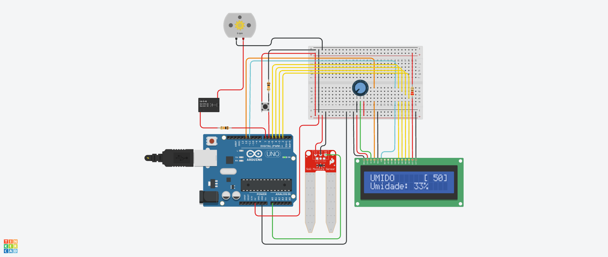
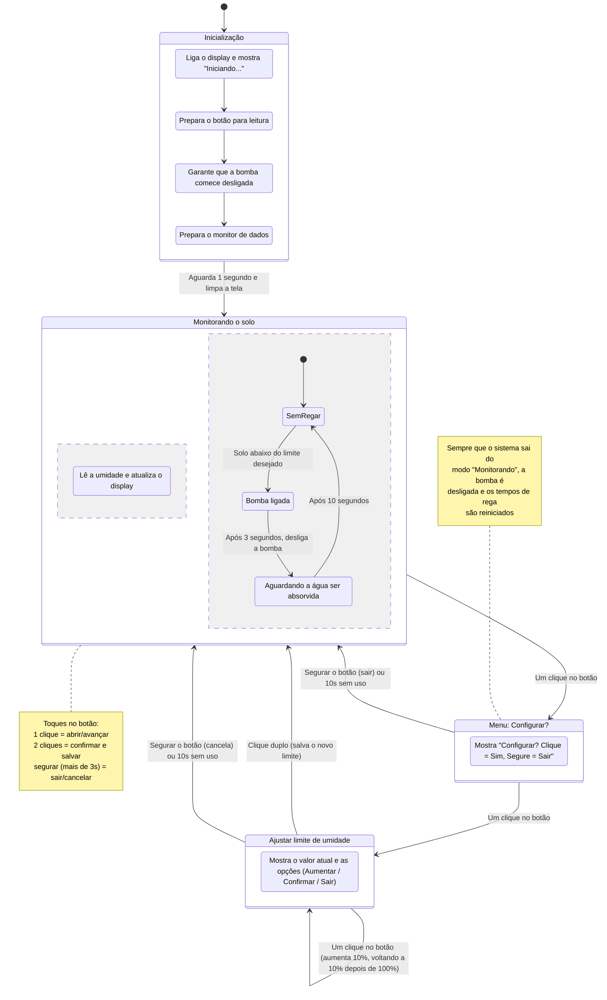

## Descrição do Projeto

Sistema de irrigação automática de plantas com Arduino. Um sensor de umidade do solo monitora continuamente a terra e aciona uma bomba d'água (via relé) sempre que a umidade fica abaixo de um limite configurável, desligando-a após um tempo de rega e aguardando a absorção da água antes de medir novamente. O limite de umidade desejado é ajustado por um único botão: um clique simples abre o menu de configuração, e cada clique adicional aumenta o alvo em 10% (com nova volta a partir de 10% após passar de 100%); um duplo clique salva o valor e um clique longo cancela a alteração. Um display LCD 16x2 mostra em tempo real a umidade atual, o status do solo (seco/úmido/molhado) e o limite configurado.



## Links
[TinkerCAD](https://www.tinkercad.com/things/67bEsqKAyAP-copy-of-grupo-s21-e/editel?returnTo=https%3A%2F%2Fwww.tinkercad.com%2Fdashboard&sharecode=ZUt0SLZPvPPE0Pp31WZ-sKmnhVgng8qRl9si2fY4PBo)

[YouTube](https://www.youtube.com/watch?v=lEWmL80-rhM)

## Fluxograma em Mermaid



## Código do Arduino

```c
#include <LiquidCrystal.h>

// Inicialização LCD
const int rs = 12, en = 11, d4 = 5, d5 = 4, d6 = 3, d7 = 2;
LiquidCrystal lcd(rs, en, d4, d5, d6, d7);

// Sensor e Relé
const int seco = 1000;
const int molhado = 0;
const int pinoRele = 7;

// Botão
const int pinoBotao = 6; 

int limiteRega = 50;
int limiteTemporario = 50;
int umidadeAtual = 0;

// Estados
enum EstadoSistema { NORMAL, MENU_PROMPT, EDITAR_LIMITE };
EstadoSistema estadoAtual = NORMAL;
unsigned long tempoInicioRega = 0;
unsigned long tempoInicioEspera = 0;
bool regando = false;
bool aguardandoAbsorcao = false;
const unsigned long TEMPO_BOMBA_LIGADA = 3000;  
const unsigned long TEMPO_ABSORCAO = 10000;

// Controle de tempo
unsigned long ultimoTempoLeitura = 0;
const long intervaloLeitura = 500;

unsigned long tempoUltimaAcao = 0;
const unsigned long TIMEOUT_MENU = 10000;

void setup() {
  lcd.begin(16, 2);
  lcd.print("Iniciando...");
  
  pinMode(pinoBotao, INPUT_PULLUP);
  pinMode(pinoRele, OUTPUT);
  digitalWrite(pinoRele, LOW);
  
  Serial.begin(9600);
  delay(1000);
  lcd.clear();
}

void loop() {

  int eventoBotao = checarBotao();

  if (eventoBotao != 0) {
    tempoUltimaAcao = millis();
  }

  switch (estadoAtual) {

    // ================= NORMAL =================
    case NORMAL:
      atualizarSensorETela();

      if (eventoBotao == 1) {
        estadoAtual = MENU_PROMPT;
        lcd.clear();
        tempoUltimaAcao = millis();
      }
      break;

    // ================= MENU =================
    case MENU_PROMPT:
      lcd.setCursor(0, 0);
      lcd.print("Configurar?     ");
      lcd.setCursor(0, 1);
      lcd.print("Click=Sim Seg=Sa");

      if (eventoBotao == 1) {
        estadoAtual = EDITAR_LIMITE;
        limiteTemporario = limiteRega;
        lcd.clear();
        tempoUltimaAcao = millis();
      } 
      else if (eventoBotao == 3) {
        estadoAtual = NORMAL;
        lcd.clear();
      }

      if (millis() - tempoUltimaAcao > TIMEOUT_MENU) {
        estadoAtual = NORMAL;
        lcd.clear();
      }

      break;

    // ================= EDITAR =================
    case EDITAR_LIMITE:
      lcd.setCursor(0, 0);
      lcd.print("Alvo Rega: ");
      lcd.print(limiteTemporario);
      lcd.print("%   ");

      lcd.setCursor(0, 1);
      lcd.print("1:+ 2:OK 3:Sair ");

      if (eventoBotao == 1) {
        limiteTemporario += 10;
        if (limiteTemporario > 100) limiteTemporario = 10;
      } 
      else if (eventoBotao == 2) {
        limiteRega = limiteTemporario;
        estadoAtual = NORMAL;
        lcd.clear();
        lcd.print("Salvo!");
        delay(1000);
        lcd.clear();
      } 
      else if (eventoBotao == 3) {
        estadoAtual = NORMAL;
        lcd.clear();
        lcd.print("Cancelado!");
        delay(1000);
        lcd.clear();
      }

      if (millis() - tempoUltimaAcao > TIMEOUT_MENU) {
        estadoAtual = NORMAL;
        lcd.clear();
        lcd.print("Timeout!");
        delay(1000);
        lcd.clear();
      }

      break;
  }

  // Controle da bomba
  if (estadoAtual == NORMAL) {
    if (umidadeAtual < limiteRega && !regando && !aguardandoAbsorcao) {
      regando = true;
      tempoInicioRega = millis();
      digitalWrite(pinoRele, HIGH);
    }

    if (regando) {
      if (millis() - tempoInicioRega >= TEMPO_BOMBA_LIGADA) {
        regando = false;
        digitalWrite(pinoRele, LOW);
        
        aguardandoAbsorcao = true;
        tempoInicioEspera = millis();
      }
    }

    if (aguardandoAbsorcao) {
      if (millis() - tempoInicioEspera >= TEMPO_ABSORCAO) {
        aguardandoAbsorcao = false; 
      }
    }

  } else {
    digitalWrite(pinoRele, LOW);
    regando = false;
    aguardandoAbsorcao = false;
  }
}

// ================= SENSOR =================
void atualizarSensorETela() {
  if (millis() - ultimoTempoLeitura >= intervaloLeitura) {
    ultimoTempoLeitura = millis();

    int SensorVal = analogRead(A0);

    umidadeAtual = map(SensorVal, seco, molhado, 100, 0);
    umidadeAtual = constrain(umidadeAtual, 0, 100);

    Serial.print("Umidade: ");
    Serial.print(umidadeAtual);
    Serial.println("%");

    lcd.setCursor(0, 0);
    if (umidadeAtual < 30) {
      lcd.print("SECO      ");
    } else if (umidadeAtual < 70) {
      lcd.print("UMIDO     ");
    } else {
      lcd.print("MOLHADO   ");
    }

    lcd.setCursor(11, 0);
    lcd.print("[");
    if (limiteRega < 100) lcd.print(" ");
    lcd.print(limiteRega);
    lcd.print("]");

    lcd.setCursor(0, 1);
    lcd.print("Umidade: ");
    lcd.print(umidadeAtual);
    lcd.print("%   ");
  }
}

// ================= BOTÃO =================
int checarBotao() {
  static bool estadoAnterior = LOW;
  static unsigned long tempoPressionado = 0;
  static unsigned long tempoSolto = 0;
  static bool esperandoDuplo = false;
  static bool cliqueLongoAtivado = false;

  bool estadoAtualBtn = !digitalRead(pinoBotao); 
  int tipoEvento = 0;

  if (estadoAtualBtn == HIGH && estadoAnterior == LOW) { 
    tempoPressionado = millis();
    cliqueLongoAtivado = false;
  } 
  else if (estadoAtualBtn == LOW && estadoAnterior == HIGH) { 
    tempoSolto = millis();
    if (!cliqueLongoAtivado) {
      if (tempoSolto - tempoPressionado > 30) { 
         if (esperandoDuplo) {
            tipoEvento = 2; 
            esperandoDuplo = false;
         } else {
            esperandoDuplo = true; 
         }
      }
    }
  }

  if (estadoAtualBtn == HIGH && !cliqueLongoAtivado && (millis() - tempoPressionado > 3000)) {
    tipoEvento = 3; 
    cliqueLongoAtivado = true;
    esperandoDuplo = false;
  }

  if (esperandoDuplo && (millis() - tempoSolto > 350)) {
    tipoEvento = 1; 
    esperandoDuplo = false;
  }

  estadoAnterior = estadoAtualBtn;
  return tipoEvento;
}

```

## Lista de componentes

| Nome | Quantidade | Componente |
|---|---|---|
| U1 | 1 |  Arduino Uno R3 |
| SEN1 | 1 |  Sensor de umidade do solo |
| M1 | 1 |  Motor CC |
| U2 | 1 |  LCD 16 x 2 |
| Rpot1 | 1 | 1 kΩ Potenciômetro |
| R3 | 1 | 220 Ω Resistor |
| S1 | 1 |  Botão |
| R1, R4 | 2 | 10 kΩ Resistor |
| K1 | 1 |  Relé SPDT |