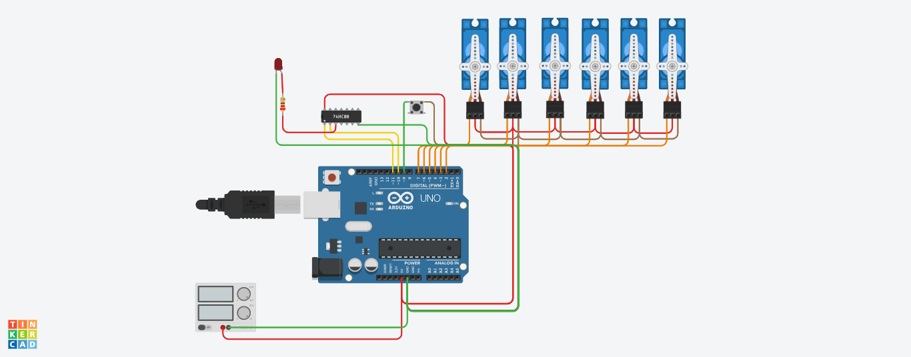
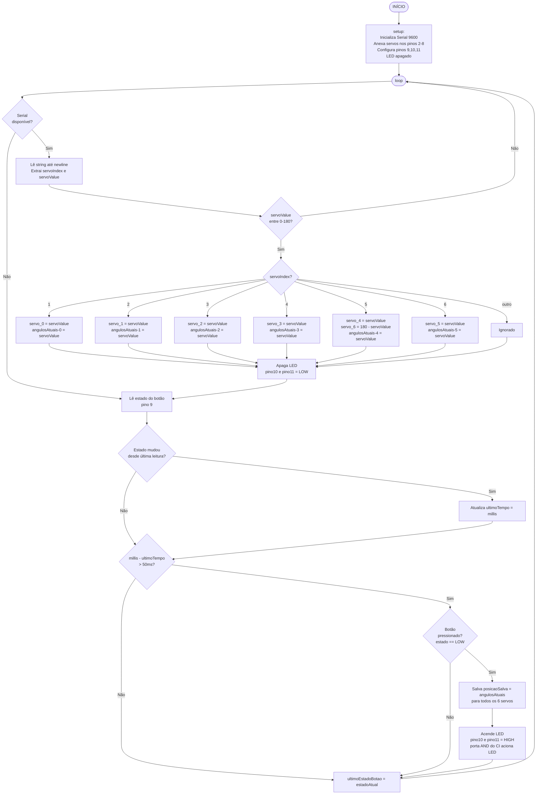

## Descrição do Projeto

O projeto consiste em um braço robótico de 6 graus de liberdade controlado via computador, utilizando um Arduino UNO como microcontrolador central.



## Links
[TinkerCAD](https://www.tinkercad.com/things/j7B74d9BEU0-grupo-s21-h/editel)

[YouTube](https://www.tinkercad.com/things/j7B74d9BEU0-grupo-s21-h/editel)

## Fluxograma em Mermaid

- https://mermaid.live/
- [State diagrams](https://mermaid.ai/app/projects/97ba2d4c-b551-45ef-8615-002f5339592d/diagrams/5238d43e-ea03-45cd-a926-9f922e2d1848/version/v0.1/edit)



## Código do Arduino

```c
#include <Servo.h>

// Servos
Servo servo_0;
Servo servo_1;
Servo servo_2;
Servo servo_3;
Servo servo_4;
Servo servo_5;
Servo servo_6; // Espelha servo_4 (case 5)

// Pinos
#define BUTTON_PIN 9
#define LED_PIN_A  10
#define LED_PIN_B  11

// Posições atuais e salvas
int angulosAtuais[6] = {90, 90, 90, 90, 90, 90};
int posicaoSalva[6]  = {90, 90, 90, 90, 90, 90};

// Controle do botão (debounce)
bool ultimoEstadoBotao = HIGH;
unsigned long ultimoTempo = 0;
#define DEBOUNCE_MS 50

void setup() {
  Serial.begin(9600);

  servo_0.attach(2);
  servo_1.attach(3);
  servo_2.attach(4);
  servo_3.attach(5);
  servo_4.attach(6);
  servo_5.attach(7);
  servo_6.attach(8);

  pinMode(BUTTON_PIN, INPUT_PULLUP);
  pinMode(LED_PIN_A, OUTPUT);
  pinMode(LED_PIN_B, OUTPUT);

  // LED apagado inicialmente
  digitalWrite(LED_PIN_A, LOW);
  digitalWrite(LED_PIN_B, LOW);
}

void loop() {

  // --- Leitura serial (comandos do PC) ---
  if (Serial.available() > 0) {
    String input = Serial.readStringUntil('\n');
    int servoIndex = input.substring(0, 1).toInt();
    int servoValue = input.substring(2).toInt();

    // Validação do valor
    if (servoValue < 0 || servoValue > 180) return;

    switch (servoIndex) {
      case 1:
        servo_0.write(servoValue);
        angulosAtuais[0] = servoValue;
        break;
      case 2:
        servo_1.write(servoValue);
        angulosAtuais[1] = servoValue;
        break;
      case 3:
        servo_2.write(servoValue);
        angulosAtuais[2] = servoValue;
        break;
      case 4:
        servo_3.write(servoValue);
        angulosAtuais[3] = servoValue;
        break;
      case 5:
        servo_4.write(servoValue);
        servo_6.write(180 - servoValue); // Movimento espelhado
        angulosAtuais[4] = servoValue;
        break;
      case 6:
        servo_5.write(servoValue);
        angulosAtuais[5] = servoValue;
        break;
      default:
        break;
    }

    // Apaga LED ao mover
    digitalWrite(LED_PIN_A, LOW);
    digitalWrite(LED_PIN_B, LOW);
  }

  // --- Leitura do botão com debounce ---
  bool estadoAtual = digitalRead(BUTTON_PIN);
  if (estadoAtual != ultimoEstadoBotao) {
    ultimoTempo = millis();
  }

  if ((millis() - ultimoTempo) > DEBOUNCE_MS) {
    if (estadoAtual == LOW) { // Botão pressionado
      for (int i = 0; i < 6; i++) {
        posicaoSalva[i] = angulosAtuais[i];
      }
      // Ambos HIGH → porta AND do CI → LED acende
      digitalWrite(LED_PIN_A, HIGH);
      digitalWrite(LED_PIN_B, HIGH);
    }
  }

  ultimoEstadoBotao = estadoAtual;
}
```

## Lista de componentes

| Nome | Quantidade | Componente |
|---|---|---|
| U1 | 1 |  Arduino Uno R3 |
| SERVO1 | 1 |  Posicional Micro servo |
| SERVO2 | 1 |  Posicional Micro servo |
| SERVO3 | 1 |  Posicional Micro servo |
| SERVO4 | 1 |  Posicional Micro servo |
| SERVO5 | 1 |  Posicional Micro servo |
| SERVO6 | 1 |  Posicional Micro servo |
| R1 | 1 | 220 Ω Resistor |
| D1 | 1 | Vermelho LED |
| S1 | 1 |  Botão |
| P1 | 1 | Fonte 5V |

## Referências

- [Robotic Arm with Arduino - Save/Play/Export/Import Positions](https://www.youtube.com/watch?v=ZEir102PxJ8)