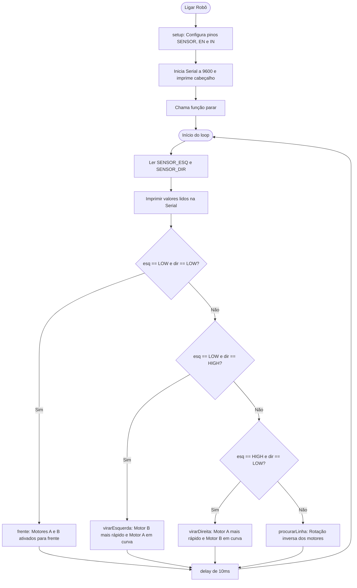

## Descrição do Projeto

Aprenda a usar um botão e acender um LED usando Arduino.


## Links
[TinkerCAD](https://www.tinkercad.com/things/7MQ4fKoqrfq-projeto-2-oficial-s21?sharecode=d5DcytD36rBioM4gOeAHoAL-c3UNUQfVYGJ-k5UfrcQ)

[YouTube](https://www.youtube.com/watch?is=v5x8IAHgcXTGrAyX&v=okpQsjOmj2M&feature=youtu.be)

## Fluxograma em Mermaid

- https://mermaid.live/
- [State diagrams](https://mermaid.js.org/syntax/stateDiagram.html)



## Código do Arduino

```c
/*
====================================================
 ROBÔ SEGUIDOR DE LINHA

 Arduino Uno + L298N + 2 Sensores 
====================================================
*/

// Sensores
#define SENSOR_ESQ 2
#define SENSOR_DIR 3

// Ponte H L298N
#define ENA 5
#define ENB 6

#define IN1 8
#define IN2 9
#define IN3 10
#define IN4 11

// Velocidade dos motores
int velocidade = 180;
int velocidadeCurva = 120;

void setup() {

  pinMode(SENSOR_ESQ, INPUT);
  pinMode(SENSOR_DIR, INPUT);

  pinMode(ENA, OUTPUT);
  pinMode(ENB, OUTPUT);

  pinMode(IN1, OUTPUT);
  pinMode(IN2, OUTPUT);
  pinMode(IN3, OUTPUT);
  pinMode(IN4, OUTPUT);

  Serial.begin(9600);

  Serial.println("================================");
  Serial.println("Seguidor de Linha");
  Serial.println("Criado por Xavier");
  Serial.println("================================");

  parar();
}

void loop() {

  int esq = digitalRead(SENSOR_ESQ);
  int dir = digitalRead(SENSOR_DIR);

  Serial.print("Esquerda: ");
  Serial.print(esq);
  Serial.print("  Direita: ");
  Serial.println(dir);

  /*
     TESTE INICIAL

     Normalmente:
     PRETO = LOW
     BRANCO = HIGH

     Caso o robô faça o contrário,
     troque LOW por HIGH abaixo.
  */

  if (esq == LOW && dir == LOW) {
    frente();
  }
  else if (esq == LOW && dir == HIGH) {
    virarEsquerda();
  }
  else if (esq == HIGH && dir == LOW) {
    virarDireita();
  }
  else {
    procurarLinha();
  }

  delay(10);
}

// =======================
// Movimento para frente
// =======================
void frente() {

  analogWrite(ENA, velocidade);
  analogWrite(ENB, velocidade);

  digitalWrite(IN1, HIGH);
  digitalWrite(IN2, LOW);

  digitalWrite(IN3, HIGH);
  digitalWrite(IN4, LOW);
}

// =======================
// Virar para esquerda
// =======================
void virarEsquerda() {

  analogWrite(ENA, velocidadeCurva);
  analogWrite(ENB, velocidade);

  digitalWrite(IN1, LOW);
  digitalWrite(IN2, LOW);

  digitalWrite(IN3, HIGH);
  digitalWrite(IN4, LOW);
}

// =======================
// Virar para direita
// =======================
void virarDireita() {

  analogWrite(ENA, velocidade);
  analogWrite(ENB, velocidadeCurva);

  digitalWrite(IN1, HIGH);
  digitalWrite(IN2, LOW);

  digitalWrite(IN3, LOW);
  digitalWrite(IN4, LOW);
}

// =======================
// Procurar a linha
// =======================
void procurarLinha() {

  analogWrite(ENA, 120);
  analogWrite(ENB, 120);

  digitalWrite(IN1, HIGH);
  digitalWrite(IN2, LOW);

  digitalWrite(IN3, LOW);
  digitalWrite(IN4, HIGH);
}

// =======================
// Parar motores
// =======================
void parar() {

  analogWrite(ENA, 0);
  analogWrite(ENB, 0);

  digitalWrite(IN1, LOW);
  digitalWrite(IN2, LOW);

  digitalWrite(IN3, LOW);
  digitalWrite(IN4, LOW);
}
```

## Lista de componentes

| Nome | Quantidade | Componente |
|---|---|---|
| U1 | 1 |  Arduino Uno R3 |
| M1, M2 | 2 |  Motor CC |
| BAT1 | 1 |  Bateria 9V |
| Bat2, Bat3, Bat4, Bat5 | 4 | 1 bateria, AA, não Bateria 1,5V |
| U2, U3 | 2 |  Sensor de infravermelho |
| U4 | 1 |  Acionador de motor de ponte H |