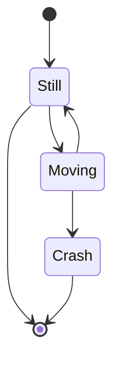

## Entrega do Projeto
- https://www.youtube.com/watch?v=SI4nTcrDv04
  
## Descrição do Projeto

### Imagem do projeto


### Links
 - [TinkerCAD](https://www.tinkercad.com)
 - [YouTube](https://www.youtube.com/)

## Fluxograma
- https://mermaid.live
  


## Código do Arduino

```c
// Paste code here

```


[Markdown](https://markdownlivepreview.com/)


