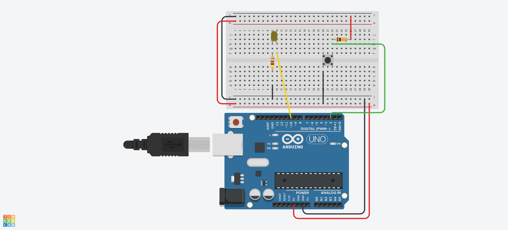

## Descrição do Projeto

### Imagem do projeto




### Links
TinkerCAD

YouTube

## Código do Arduino

```c
void setup()
{
  pinMode(2, INPUT);
  pinMode(10, OUTPUT);
}

void loop()
{
  // Se o botão estiver apertado:
  if (digitalRead(2) == HIGH) {
    // Ligue o LED.
    digitalWrite(10, HIGH);
    // Caso contrário,
  } else {
    // Desligue o LED.
    digitalWrite(10, LOW);
  }
  delay(10); // Delay a little bit to improve simulation performance
}
```

## Lista de componentes

| Nome | Quantidade | Componente |
|---|---|---|
| U1 | 1 |  Arduino Uno R3 |
| R1 | 1 | 470 Ω Resistor |
| D2 | 1 | Amarelo LED |
| S1 | 1 |  Botão |
| R2 | 1 | 10 kΩ Resistor |